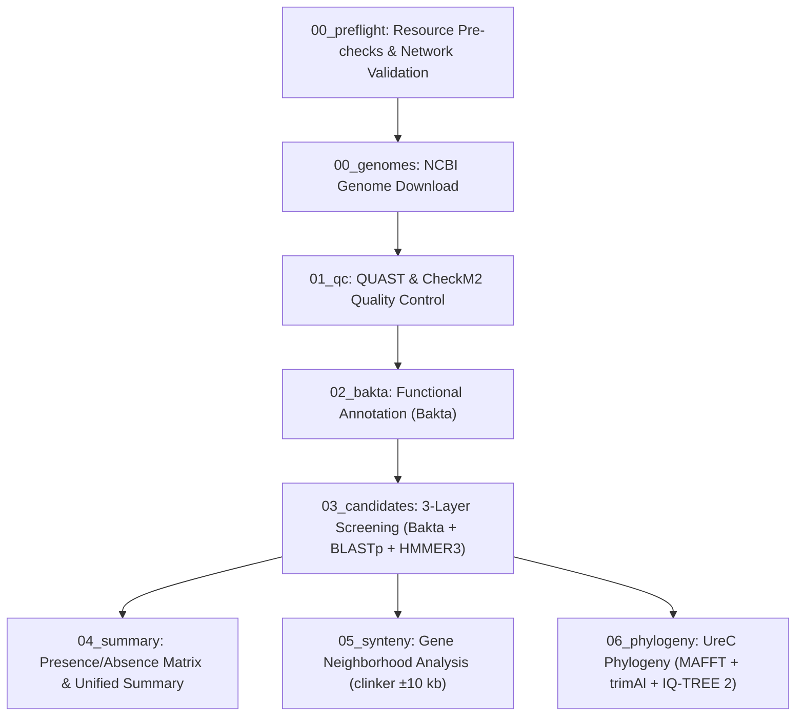
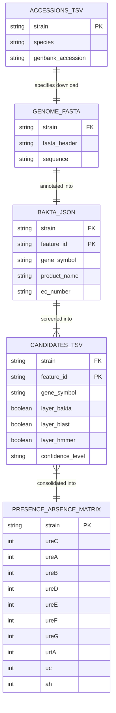

# Baafes-urease-mining

[](README.md)
[](README.en.md)

> 🌐 **Language Switch / Alternar Idioma**: Read this documentation in [Português-BR](README.md).

---

## 1. General Project Description

**Baafes-urease-mining** is an automated bioinformatics pipeline built in Nextflow DSL2 and Python 3.11, fully containerized via Docker. It is designed for genomic mining, functional identification, and evolutionary analysis of genes involved in urea catabolism across bacterial genomes.

The primary target dataset comprises 10 endospore-forming aerobic bacterial (AEFB) genomes from the **CBafes/UnB collection** isolated from soils of Distrito Federal, Brazil (GenBank accessions `VKHW00000000.1` to `VKIC00000000.1`). The system simultaneously investigates three metabolic avenues:

1. **Canonical Urease Pathway**: Catalytic subunits ($\gamma$ - UreA, $\beta$ - UreB, $\alpha$ - UreC) and accessory maturation proteins (UreD, UreE, UreF, UreG).
2. **Active Urea Transport System**: ABC transporter complex $urtABCDE$ (UrtA, UrtB, UrtC, UrtD, UrtE).
3. **Nickel-Independent Alternative Pathway**: Urea carboxylase (`uc`, EC 6.3.4.6) coupled with allophanate hydrolase (`ah`, EC 3.5.1.54).

---

## 2. Quick-Start

### Prerequisites

The whole pipeline runs **inside the `bafes-urease` container**. The host only needs:

- Docker Engine >= 24.0 (with your user in the `docker` group)
- Git, Bash, and `curl`
- Disk space: **~160 GB free** for the full Bakta database (use `--bakta-db-type light` for ~10 GB,
  or `--skip-bakta-db` if you already have one)

Nextflow, Bakta, BLAST+, HMMER, MAFFT, trimAl, IQ-TREE, QUAST, and clinker all ship inside the
image — none of them need to be installed on the host. To run without Docker (with a preconfigured
Conda/Mamba environment), use `--runtime local`.

### Three-Step Command Sequence

```bash
# Clone the repository and enable the wrapper
git clone https://github.com/waldeyr/bafes-urease.git
cd bafes-urease
chmod +x run.sh

# Step A — Bootstrap: builds the image, downloads Pfam and the full Bakta database.
#    First run takes hours (image build ~20 min + Bakta full DB ~75 GB). Idempotent:
#    every completed step is skipped on subsequent runs.
#    Upgrading from an install that used the old `bafes_urease` tag? Retag first to
#    avoid a ~20-minute rebuild:
#        docker tag bafes_urease bafes-urease && docker rmi bafes_urease
./run.sh --bootstrap --runtime docker --container-image bafes-urease

# Step B — Build & Pre-flight Check (validates environment & resource reachability)
./run.sh --build --runtime docker --container-image bafes-urease

# Step C — Pipeline Execution with real-time tqdm progress tracking & detailed logging
./run.sh --exec --runtime docker --container-image bafes-urease --verbose
```

Every `run.sh` invocation returns the prompt immediately and keeps running inside a detached
`screen` session — see [Automatic `screen` Session](#87-automatic-screen-session) for following the
log and reading the real exit code. Further parameter combinations (reduced database, resuming an
interrupted run, alternative paths, running without a container) are in
[Installation & Usage](#8-installation--usage).

---

## 3. Pipeline Overview

The pipeline executes a modular, multi-tier analysis workflow:



---

## 4. Phase-by-Phase Detailed View, Rules & Filters

| Phase ID & Name | Process / Script | Description | Rules & Applied Filters | Output Artifacts |
| :--- | :--- | :--- | :--- | :--- |
| **00_preflight** | `resource_checker.py` / `PREFLIGHT_CHECK` | Pre-flight validation of external resources & network endpoints | Validates HTTP Status 200/JSON for 10 NCBI accessions, Pfam FTP URL, and Bakta Zenodo DB. Aborts with Exit Code 4 if critical resources are unreachable. | `results/00_preflight/preflight_status.txt` |
| **00_genomes** | `DOWNLOAD_GENOME` | Automated acquisition of bacterial assembly FASTA files | Queries NCBI Datasets CLI v2 by accession. Automatically falls back to NCBI Entrez `efetch` if Datasets API fails. | `results/00_genomes/{strain}.fna` |
| **01_qc** | `QC_QUAST` & `QC_CHECKM2` | Genomic assembly quality control & contamination check | Evaluates N50, GC content, total length (QUAST), completeness >= 95%, and contamination <= 5% (CheckM2). | `results/01_qc/quast/`, `results/01_qc/checkm2/` |
| **02_bakta** | `BAKTA_ANNOTATE` | Structural & functional genome annotation | Uses Bakta v1.9+ with full database. Assigns RefSeq/UniRef IDs, EC numbers (3.5.1.5, 6.3.4.6, 3.5.1.54), and gene symbols. | `results/02_bakta/{strain}/` (.json, .gff3, .faa, .gbff) |
| **03_candidates** | `extract_urease_candidates.py` | 3-Layer candidate screening & evidence consolidation | **Layer A (Bakta)**: EC & gene symbol filtering.<br>**Layer B (BLASTp)**: E-value <= 1e-5, Identity >= 30%, Coverage >= 50%.<br>**Layer C (HMMER3)**: Domain score >= 20.0 against Pfam profiles.<br>**Consensus Rule**: High Confidence (>=2 layers), Medium Confidence (1 layer). | `results/03_candidates/{strain}/{strain}_candidates.tsv` |
| **04_summary** | `merge_strain_results.py` | Cross-strain matrix aggregation | Merges candidate TSVs across all strains. Constructs binary (1/0) matrix for 10 target genes ($ureA-G$, $urtA$, $uc$, $ah$). | `results/04_summary/urease_presence_absence.tsv`, `summary_unified.tsv` |
| **05_synteny** | `synteny_analysis.py` | Gene neighborhood & synteny visualization | Extracts $\pm 10$ kb genomic window centered on $ureC$. Runs `clinker` to produce an interactive SVG/HTML map. | `results/05_synteny/synteny.html` |
| **06_phylogeny** | `build_phylogeny.py` | UreC evolutionary tree reconstruction | Requires >= 3 UreC protein sequences. Runs MAFFT `--auto` alignment $\rightarrow$ trimAl `-automated1` $\rightarrow$ IQ-TREE 2 (1000 ultrafast bootstraps). | `results/06_phylogeny/ureC.treefile`, `ureC.aln` |

---

## 5. Data Provenance & Lineage Diagram

The diagram below maps data flow from primary external databases to downstream analytical artifacts:

```mermaid
flowchart LR
    subgraph Primary_Sources ["Primary Data Sources"]
        NCBI["NCBI GenBank (nuccore / WGS)"]
        PfamDB["EMBL-EBI Pfam-A Database"]
        BaktaDB["Bakta Database (Zenodo DB)"]
        RefDB["Curated Reference FASTA (data/urease_references.fasta)"]
    end

    subgraph Internal_Processing ["Pipeline Processing Engine"]
        Accessions["data/accessions.tsv"] -->|10 Accessions| Preflight["Pre-flight Check"]
        NCBI -->|FASTA Download| Genomes["00_genomes/"]
        Genomes -->|Assembly FASTA| QC["01_qc (QUAST & CheckM2)"]
        Genomes -->|Assembly FASTA| Bakta["02_bakta (Annotation)"]
        BaktaDB -->|RefSeq/UniRef| Bakta
        
        Bakta -->|FAA & JSON| Screening["03_candidates (BLASTp + HMMER3)"]
        PfamDB -->|PF00547, etc.| Screening
        RefDB -->|Reference Proteins| Screening
    end

    subgraph Derived_Outputs ["Derived Analytical Products"]
        Screening -->|Consolidated Candidates| Summary["04_summary (urease_presence_absence.tsv)"]
        Screening -->|GBFF Loci (±10 kb)| Synteny["05_synteny (synteny.html)"]
        Screening -->|UreC FASTA| Phylogeny["06_phylogeny (ureC.treefile)"]
    end
```

---

## 6. Technology & Software Versions

| Technology / Software | Version | Role in Pipeline | Reference / Source |
| :--- | :--- | :--- | :--- |
| **Linux Ubuntu (Jammy)** | 22.04 LTS | Container OS base | Canonical |
| **Python** | 3.11.x | Core scripting, consolidation, tqdm tracking | Python Software Foundation |
| **OpenJDK JRE** | 17.0+ | Runtime environment for Nextflow | Eclipse Temurin / OpenJDK |
| **Nextflow** | >= 24.04.0 | DSL2 Workflow Orchestrator | Seqera / Nextflow |
| **Docker Engine** | >= 24.0+ | Containerization & runtime isolation | Docker Inc. |
| **NCBI Datasets CLI / Entrez** | v2 / E-utilities | Automated genome assembly retrieval | NCBI / NLM / NIH |
| **Bakta** | >= 1.9.0 | Functional genome annotation engine | Schwengers et al. (2021) |
| **QUAST** | >= 5.2.0 | Genome assembly quality evaluation | Gurevich et al. (2013) |
| **CheckM2** | >= 1.0.2 | Genome completeness & contamination estimation | Chklovski et al. (2023) |
| **BLAST+ (blastp)** | >= 2.14.0 | Protein sequence alignment | Camacho et al. (2009) |
| **HMMER3 (hmmscan)** | >= 3.3.2 | Profile Hidden Markov Model search | Eddy et al. (2011) |
| **clinker** | >= 0.0.28 | Gene cluster synteny comparison & visualization | Gilchrist & Chooi (2021) |
| **MAFFT** | >= 7.520 | Multiple protein sequence alignment | Katoh & Standley (2013) |
| **trimAl** | >= 1.4.1 | Alignment trimming & gap filtering | Capella-Gutiérrez et al. (2009) |
| **IQ-TREE 2** | >= 2.2.0 | Maximum Likelihood phylogenetic tree inference | Minh et al. (2020) |
| **pandas / tqdm / Biopython** | Latest stable | Dataframes, progress bars, and FASTA handling | PyPI Community |

---

## 7. Data Integrity

The pipeline **never fabricates data**. Any step that cannot produce a real result from the
NCBI genomes fails explicitly (exit != 0) instead of substituting a plausible-looking value:

- **Genomes.** The study's accessions are WGS master records (e.g. `VKHW00000000.1`), which
  carry no sequence — an `efetch` on them returns zero bytes.
  [download_genome.py](bin/download_genome.py) resolves the accession to its assembly
  (`GCA_`/`GCF_`) before downloading, then validates contigs, base count (>= 500 kb), and the
  nucleotide alphabet. Without a real genome, the strain does not continue.
- **QC.** CheckM2 actually runs against its database. There are no hardcoded
  completeness/contamination values.
- **Annotation.** Without the Bakta database, `BAKTA_ANNOTATE` fails. There is no substitute
  annotation with invented genes.
- **References.** The sequences in [urease_references.fasta](data/urease_references.fasta) are
  downloaded from UniProt via a REST query: reviewed (Swiss-Prot) Firmicutes (`taxonomy_id:1239`)
  urease proteins (`protein_name:urease`). Nothing is synthesised locally — a network failure, a
  truncated response or an empty result set aborts without writing the FASTA. Regenerate with
  `python3 bin/fetch_references.py`.
- **Synteny and phylogeny.** No placeholder HTML and no partial trees. With fewer than 3 UreC
  sequences, that is recorded in `phylogeny_status.txt` as a legitimate outcome — no tree is
  possible — and no tree file is written.

Reference set — query `(protein_name:urease) AND (taxonomy_id:1239) AND (reviewed:true)` against
`https://rest.uniprot.org/uniprotkb/stream`, with a sanity floor of 100 sequences (below that the
response is treated as truncated and aborts). The set is **live**: it tracks UniProt and changes
with every release (218 sequences on release 2026_02). Reproducibility does not rest on a fixed
accession list but on the provenance record written next to the FASTA
(`data/urease_references.provenance.txt` — release, date, count and `sha256`). To pin a different
slice, use `--query` or `--url`.

---

## 8. Installation & Usage

### Prerequisites

Same as the [Quick-Start](#2-quick-start): Docker Engine >= 24.0 with your user in the `docker`
group, Git, Bash, `curl`, and ~160 GB free for the full Bakta database. Every bioinformatics tool
ships inside the image.

### 8.1 Clone the repository
```bash
git clone https://github.com/waldeyr/bafes-urease.git
cd bafes-urease
```

### 8.2 Make the wrapper script executable
```bash
chmod +x run.sh
```

### 8.3 Quick-Start sequence

The recommended sequence, repeated here in full:

```bash
# Step A — Bootstrap: builds the image, downloads Pfam and the full Bakta database.
#    First run takes hours (image build ~20 min + Bakta full DB ~75 GB). Idempotent:
#    every completed step is skipped on subsequent runs.
#    Upgrading from an install that used the old `bafes_urease` tag? Retag first to
#    avoid a ~20-minute rebuild:
#        docker tag bafes_urease bafes-urease && docker rmi bafes_urease
./run.sh --bootstrap --runtime docker --container-image bafes-urease

# Step B — Build & Pre-flight Check (validates environment & resource reachability)
./run.sh --build --runtime docker --container-image bafes-urease

# Step C — Pipeline Execution with real-time tqdm progress tracking & detailed logging
./run.sh --exec --runtime docker --container-image bafes-urease --verbose
```

### 8.4 Further parameter combinations

All three modes (`--bootstrap`, `--build`, `--exec`) accept the same options, and the defaults
already match the Quick-Start (`--runtime docker`, `--container-image bafes-urease`,
`--bakta-db-type full`). The examples below cover the most common deviations.

**Bootstrap with the reduced database** — when ~160 GB is not available; the light Bakta DB takes
~10 GB and annotates fewer RefSeq/UniRef identifiers:

```bash
./run.sh --bootstrap --bakta-db-type light
```

**Bootstrap reusing a Bakta database already on the host** — avoids re-downloading 75 GB by
pointing at the copy you already have:

```bash
./run.sh --bootstrap --skip-bakta-db --bakta-db /data/bakta/db
./run.sh --exec      --bakta-db /data/bakta/db --verbose
```

**Bootstrap forcing an image rebuild** — after editing `Dockerfile` or `environment.yml`:

```bash
./run.sh --bootstrap --force-rebuild
```

**Check and update drifted databases** — without `--update-db`, bootstrap only warns about the
version drift and keeps the local copy:

```bash
./run.sh --bootstrap --update-db
```

**Chain build and execution propagating the exit code** — `--wait` blocks until each phase ends,
so the `&&` only fires if the previous one exited 0:

```bash
./run.sh --build --wait && ./run.sh --exec --wait --verbose
```

**Debug in the foreground** — no `screen` session, output straight to the terminal:

```bash
./run.sh --exec --no-screen --verbose
```

**Resume an interrupted run** — reuses the Nextflow cache instead of redoing completed phases:

```bash
./run.sh --exec --resume --verbose
```

**Run a subset of strains into a separate directory** — useful to smoke-test the pipeline with 1
or 2 genomes before the full round, without overwriting `results/`:

```bash
head -3 data/accessions.tsv > data/accessions_test.tsv
./run.sh --exec --accessions data/accessions_test.tsv --outdir results_test --verbose
```

**Point every input at alternative paths** — databases and references outside the project
directory (for example, on a shared volume):

```bash
./run.sh --exec \
  --accessions /data/bafes/accessions.tsv \
  --references /data/bafes/urease_references.fasta \
  --pfam       /data/databases/Pfam-A.hmm \
  --bakta-db   /data/databases/bakta/db \
  --outdir     /data/bafes/results \
  --verbose
```

**Run without Docker** — requires a preconfigured Conda/Mamba environment with the tools on the
host:

```bash
./run.sh --exec --runtime local --verbose
```

**Run with Singularity/Apptainer** — on HPC clusters where Docker is unavailable:

```bash
./run.sh --exec --runtime singularity --container-image bafes-urease --verbose
```

**Full unattended round** — reduced database, everything in the foreground and chained, suitable
for launching inside a queue job:

```bash
./run.sh --bootstrap --bakta-db-type light --no-screen \
  && ./run.sh --build --no-screen \
  && ./run.sh --exec --no-screen --verbose
```

### 8.5 Available options

| Option | Effect |
| :--- | :--- |
| `--bootstrap` | Prepares inputs, image, and databases (idempotent) |
| `--build` | Validates environment and resources (pre-flight check) |
| `--exec` | Runs the Nextflow pipeline |
| `--verbose` | Enables detailed reports and logs |
| `--resume` | Resumes an interrupted run from the Nextflow cache |
| `--force-rebuild` | Rebuilds the Docker image even if it already exists |
| `--bakta-db-type full\|light` | Full database (~75 GB, default) or reduced one (~10 GB) |
| `--skip-bakta-db` | Skips the Bakta database download (use if you already have one at `--bakta-db`) |
| `--update-db` | Re-downloads databases whose version drifted from the available one (without it, only warns) |
| `--runtime docker\|singularity\|local` | Execution engine (default: `docker`) |
| `--container-image IMAGE` | Container image tag (default: `bafes-urease`) |
| `--no-screen` | Runs in the foreground, without creating a session |
| `--wait` | Blocks until the session finishes and propagates the real exit code |
| `--accessions PATH` | Path to `accessions.tsv` (default: `data/accessions.tsv`) |
| `--references PATH` | Path to the references FASTA (default: `data/urease_references.fasta`) |
| `--pfam PATH` | Path to `Pfam-A.hmm` (default: `Pfam-A.hmm`) |
| `--bakta-db PATH` | Path to the Bakta database (default: `db/db`) |
| `--outdir PATH` | Output directory (default: `results`) |
| `-h`, `--help` | Displays the help message |

### 8.6 Database Version Checking

Databases are not only checked for existence — the installed version is checked too. This matters
because the source URLs are **rolling**: `Pfam/current_release` serves different releases over
time, so "the file exists" does not say *which* release sits on disk.

`run.sh` records the downloaded version under `db/.versions/` and compares it against what is
available:

| Database | Local version | Available version |
| :--- | :--- | :--- |
| Pfam | `db/.versions/pfam` (release recorded at download) | `Pfam.version.gz` at EMBL-EBI |
| Bakta | `major.minor` from `version.json` + type in `db/.versions/bakta_type` | `bakta_db list` |
| CheckM2 | DIAMOND db filename (e.g. `uniref100.KO.1.dmnd`) | no queryable index |
| AMRFinderPlus | target of the `amrfinderplus-db/latest` symlink | queried by `amrfinder_update` |
| UniProt references | `uniprot_release` in `data/urease_references.provenance.txt` | `x-uniprot-release` header from the REST API |

**Nothing is re-downloaded while the database exists**, not even on version drift: `--bootstrap`
only warns and keeps the local copy. Re-fetching the full Bakta DB means ~75 GB and hours of
network, so updating is always explicit, via `--update-db`. With no network to query the remote
version, the local copy is kept without error.

The UniProt references come from a **live** query (`fetch_references.py`) whose result set changes
with every release. What identifies the local FASTA is therefore the release stamped into
`data/urease_references.provenance.txt` — alongside the record count and `sha256`. A FASTA
generated before that record has no known release: `--bootstrap` warns and keeps the file.

When updating (Bakta and CheckM2), the current database is moved to `.old` and only discarded once
the new one arrives intact; if the download fails, the working database is restored, not lost.

```bash
# Check versions and update only what drifted
./run.sh --bootstrap --update-db
```

### 8.7 Automatic `screen` Session

Every `run.sh` invocation creates its own **detached** `screen` session and returns the prompt
immediately, so an SSH drop does not kill the run — which matters because bootstrap takes hours
and `--exec` takes longer still.

```
>>> Sessão / Session : bafes-bootstrap (screen)
>>> Reanexar / Attach: screen -r bafes-bootstrap        (detach with Ctrl-A D)
>>> Log              : .logs/bootstrap-20260727-1430.log
>>> Código de saída  : .logs/bootstrap-20260727-1430.exitcode
```

**Mind the exit code.** Because the run continues in the background, the outer invocation returns
`0` even when the pipeline fails. The real code is written to the `.exitcode` file. To chain
commands or automate, use `--wait`, which blocks until completion and propagates the code:

```bash
./run.sh --build --runtime docker --wait && ./run.sh --exec --runtime docker --wait
```

If `screen` is unavailable, `run.sh` falls back to `tmux`; with neither, it runs in the foreground
with a warning. A second invocation of the same phase is refused (exit 8) rather than duplicated.

### 8.8 Common Problem: `permission denied` on the Docker socket

If the command works in a fresh terminal but fails inside an older `screen` session, Docker is not
the cause. A process's supplementary groups are fixed at login by `setgroups()` and are never
re-read from `/etc/group`; a session created **before** `usermod -aG docker` carries the old set,
and every shell inside it inherits that staleness. `run.sh` detects this and re-executes through
`sg docker`, which re-reads `/etc/group` — there is no need to kill the session.

If it still fails, the user genuinely is not in the group. The admin must run
`sudo usermod -aG docker $USER`, and you must open a new SSH session.

### 8.9 Configuration via `.env`

Copy the template and fill it in. `run.sh` loads `.env` automatically and forwards the
variables into the container. `.env` is in `.gitignore` — **never commit your key**.

```bash
cp .env.example .env
```

| Variable | Effect |
| :--- | :--- |
| `NCBI_API_KEY` | Raises the E-utilities rate limit from 3 to 10 req/s. **Recommended**: without it the 10-accession pre-check and the genome downloads are throttled to 3 req/s and are more prone to HTTP 429. Generate one at [account.ncbi.nlm.nih.gov](https://account.ncbi.nlm.nih.gov/) → Account Settings → API Key Management |
| `NCBI_EMAIL` | Contact e-mail required by the NCBI E-utilities policy |
| `BAFES_INSECURE_SSL=1` | Disables TLS verification (only for networks behind a TLS-intercepting proxy) |

### 8.10 Direct Nextflow Execution (Optional)

Requires Nextflow and the tools on the host, or the `docker` profile (one container per process):

```bash
nextflow run main.nf \
   --accessions data/accessions.tsv \
   --bakta_db ./db/db \
   --pfam_hmm ./Pfam-A.hmm \
   --references data/urease_references.fasta \
   --outdir results \
   -profile docker
```

The reports (`nf_report.html`, `nf_trace.txt`, `nf_timeline.html`, `nf_dag.html`) are already
enabled in `nextflow.config` — there is no need to pass the `-with-*` flags.

### 8.11 Generated Output Structure
```
results/
├── 00_preflight/    # Pre-flight validation status
├── 00_genomes/      # Assembly FASTA files downloaded from NCBI
├── 01_qc/           # QC reports (QUAST + CheckM2)
├── 02_bakta/        # Annotations in GFF3, FAA, JSON, GBFF per strain
├── 03_candidates/   # Consolidated candidates per strain (Bakta + BLASTp + HMMER)
├── 04_summary/      # urease_presence_absence.tsv matrix and unified summary
├── 05_synteny/      # Interactive synteny viewer (synteny.html)
└── 06_phylogeny/    # UreC phylogenetic tree (ureC.treefile and alignments)
```

---

## 9. Database & Data Dictionary

### Database Diagram

The pipeline persists tab-delimited tabular files (`.tsv`), structured JSON documents, FASTA
alignments, and HTML viewers on a directory-structured filesystem:



### Data Dictionary

#### Table: `data/accessions.tsv`
| Field | Type | Description |
| :--- | :--- | :--- |
| `strain` | String (PK) | Short unique identifier of the bacterial strain (e.g. S1, S2) |
| `species` | String | Bacterial species binomial (e.g. Lysinibacillus fusiformis) |
| `genbank_accession` | String | GenBank assembly accession code (e.g. VKHW00000000.1) |

#### Table: `results/03_candidates/{strain}/{strain}_candidates.tsv`
| Field | Type | Description |
| :--- | :--- | :--- |
| `strain` | String (FK) | Bacterial strain identifier |
| `feature_id` | String (PK) | Identifier of the gene/protein annotated by Bakta |
| `gene` | String | Gene symbol assigned (e.g. ureC, urtA, uc) |
| `product` | String | Functional description of the protein |
| `layer_bakta` | Boolean | Detection flag for Layer A (Bakta) |
| `layer_blast` | Boolean | Detection flag for Layer B (BLASTp) |
| `layer_hmmer` | Boolean | Detection flag for Layer C (Pfam HMMER) |
| `confidence` | String | Confidence level derived from the consensus (High, Medium, Low) |

#### Table: `results/04_summary/urease_presence_absence.tsv`
| Field | Type | Description |
| :--- | :--- | :--- |
| `strain` | String (PK) | Unique strain identifier |
| `ureC` | Integer (0/1) | Presence (1) or absence (0) of the urease $\alpha$ subunit |
| `ureA` | Integer (0/1) | Presence (1) or absence (0) of the urease $\gamma$ subunit |
| `ureB` | Integer (0/1) | Presence (1) or absence (0) of the urease $\beta$ subunit |
| `ureD` | Integer (0/1) | Presence (1) or absence (0) of the accessory protein UreD |
| `ureE` | Integer (0/1) | Presence (1) or absence (0) of the accessory protein UreE |
| `ureF` | Integer (0/1) | Presence (1) or absence (0) of the accessory protein UreF |
| `ureG` | Integer (0/1) | Presence (1) or absence (0) of the accessory GTPase UreG |
| `urtA` | Integer (0/1) | Presence (1) or absence (0) of the urea transporter UrtA |
| `uc` | Integer (0/1) | Presence (1) or absence (0) of urea carboxylase |
| `ah` | Integer (0/1) | Presence (1) or absence (0) of allophanate hydrolase |
