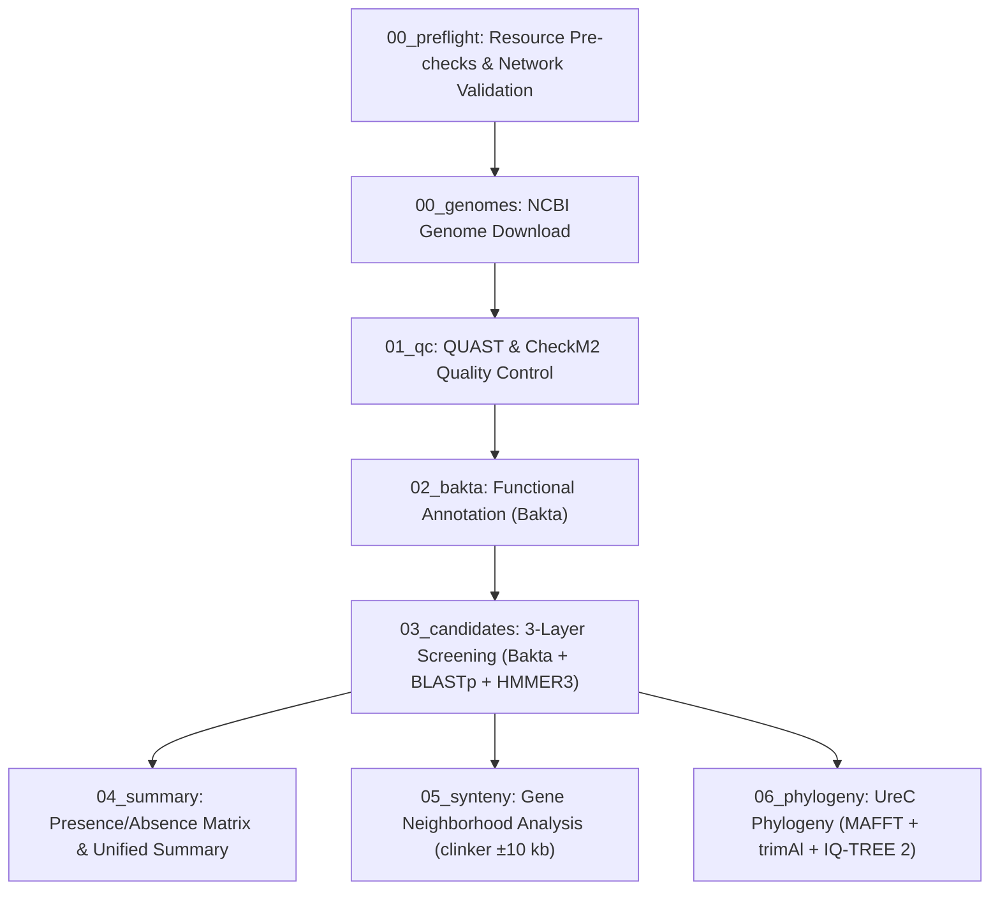

# Baafes-urease-mining

[](README.md)
[](README.en.md)

> 🌐 **Language Switch / Alternar Idioma**: Read this documentation in [Português-BR](README.md).

---

## 1. General Project Description

**Baafes-urease-mining** is an automated bioinformatics pipeline built in Nextflow DSL2 and Python 3.11, fully containerized via Docker. It is designed for genomic mining, functional identification, and evolutionary analysis of genes involved in urea catabolism across bacterial genomes.

The primary target dataset comprises 10 endospore-forming aerobic bacterial (AEFB) genomes from the **CBafes/UnB collection** isolated from soils of Distrito Federal, Brazil (GenBank accessions `VKHW00000000.1` to `VKIC00000000.1`). The system simultaneously investigates three metabolic avenues:

1. **Canonical Urease Pathway**: Catalytic subunits ($\gamma$ - UreA, $\beta$ - UreB, $\alpha$ - UreC) and accessory maturation proteins (UreD, UreE, UreF, UreG).
2. **Active Urea Transport System**: ABC transporter complex $urtABCDE$ (UrtA, UrtB, UrtC, UrtD, UrtE).
3. **Nickel-Independent Alternative Pathway**: Urea carboxylase (`uc`, EC 6.3.4.6) coupled with allophanate hydrolase (`ah`, EC 3.5.1.54).

---

## 2. Pipeline Overview

The pipeline executes a modular, multi-tier analysis workflow:



---

## 3. Quick-Start

### Prerequisites
- Docker Engine >= 24.0 (or Conda/Mamba for local execution)
- Git & Bash

### Step-by-Step Execution Command Sequence

```bash
# 1. Clone the repository
git clone https://github.com/waldeyr/bafes-urease.git
cd bafes-urease

# 2. Make the wrapper script executable
chmod +x run.sh

# 3. Step A — Bootstrap (prepares directories, templates, and pre-downloads)
./run.sh --bootstrap --runtime docker --container-image bafes_urease

# 4. Step B — Build & Pre-flight Check (validates environment & runs dry-run resource checks)
./run.sh --build --runtime docker --container-image bafes_urease

# 5. Step C — Pipeline Execution with real-time tqdm progress tracking & detailed logging
./run.sh --exec --runtime docker --container-image bafes_urease --verbose
```

---

## 4. Phase-by-Phase Detailed View, Rules & Filters

| Phase ID & Name | Process / Script | Description | Rules & Applied Filters | Output Artifacts |
| :--- | :--- | :--- | :--- | :--- |
| **00_preflight** | `resource_checker.py` / `PREFLIGHT_CHECK` | Pre-flight validation of external resources & network endpoints | Validates HTTP Status 200/JSON for 10 NCBI accessions, Pfam FTP URL, and Bakta Zenodo DB. Aborts with Exit Code 4 if critical resources are unreachable. | `results/00_preflight/preflight_status.txt` |
| **00_genomes** | `DOWNLOAD_GENOME` | Automated acquisition of bacterial assembly FASTA files | Queries NCBI Datasets CLI v2 by accession. Automatically falls back to NCBI Entrez `efetch` if Datasets API fails. | `results/00_genomes/{strain}.fna` |
| **01_qc** | `QC_QUAST` & `QC_CHECKM2` | Genomic assembly quality control & contamination check | Evaluates N50, GC content, total length (QUAST), completeness >= 95%, and contamination <= 5% (CheckM2). | `results/01_qc/quast/`, `results/01_qc/checkm2/` |
| **02_bakta** | `BAKTA_ANNOTATE` | Structural & functional genome annotation | Uses Bakta v1.9+ with full database. Assigns RefSeq/UniRef IDs, EC numbers (3.5.1.5, 6.3.4.6, 3.5.1.54), and gene symbols. | `results/02_bakta/{strain}/` (.json, .gff3, .faa, .gbff) |
| **03_candidates** | `extract_urease_candidates.py` | 3-Layer candidate screening & evidence consolidation | **Layer A (Bakta)**: EC & gene symbol filtering.<br>**Layer B (BLASTp)**: E-value <= 1e-5, Identity >= 30%, Coverage >= 50%.<br>**Layer C (HMMER3)**: Domain score >= 20.0 against Pfam profiles.<br>**Consensus Rule**: High Confidence (>=2 layers), Medium Confidence (1 layer). | `results/03_candidates/{strain}/{strain}_candidates.tsv` |
| **04_summary** | `merge_strain_results.py` | Cross-strain matrix aggregation | Merges candidate TSVs across all strains. Constructs binary (1/0) matrix for 10 target genes ($ureA-G$, $urtA$, $uc$, $ah$). | `results/04_summary/urease_presence_absence.tsv`, `summary_unified.tsv` |
| **05_synteny** | `synteny_analysis.py` | Gene neighborhood & synteny visualization | Extracts $\pm 10$ kb genomic window centered on $ureC$. Runs `clinker` to produce an interactive SVG/HTML map. | `results/05_synteny/synteny.html` |
| **06_phylogeny** | `build_phylogeny.py` | UreC evolutionary tree reconstruction | Requires >= 3 UreC protein sequences. Runs MAFFT `--auto` alignment $\rightarrow$ trimAl `-automated1` $\rightarrow$ IQ-TREE 2 (1000 ultrafast bootstraps). | `results/06_phylogeny/ureC.treefile`, `ureC.aln` |

---

## 5. Data Provenance & Lineage Diagram

The diagram below maps data flow from primary external databases to downstream analytical artifacts:

```mermaid
flowchart LR
    subgraph Primary_Sources ["Primary Data Sources"]
        NCBI["NCBI GenBank (nuccore / WGS)"]
        PfamDB["EMBL-EBI Pfam-A Database"]
        BaktaDB["Bakta Database (Zenodo DB)"]
        RefDB["Curated Reference FASTA (data/urease_references.fasta)"]
    end

    subgraph Internal_Processing ["Pipeline Processing Engine"]
        Accessions["data/accessions.tsv"] -->|10 Accessions| Preflight["Pre-flight Check"]
        NCBI -->|FASTA Download| Genomes["00_genomes/"]
        Genomes -->|Assembly FASTA| QC["01_qc (QUAST & CheckM2)"]
        Genomes -->|Assembly FASTA| Bakta["02_bakta (Annotation)"]
        BaktaDB -->|RefSeq/UniRef| Bakta
        
        Bakta -->|FAA & JSON| Screening["03_candidates (BLASTp + HMMER3)"]
        PfamDB -->|PF00547, etc.| Screening
        RefDB -->|Reference Proteins| Screening
    end

    subgraph Derived_Outputs ["Derived Analytical Products"]
        Screening -->|Consolidated Candidates| Summary["04_summary (urease_presence_absence.tsv)"]
        Screening -->|GBFF Loci (±10 kb)| Synteny["05_synteny (synteny.html)"]
        Screening -->|UreC FASTA| Phylogeny["06_phylogeny (ureC.treefile)"]
    end
```

---

## 6. Technology & Software Versions

| Technology / Software | Version | Role in Pipeline | Reference / Source |
| :--- | :--- | :--- | :--- |
| **Linux Ubuntu (Jammy)** | 22.04 LTS | Container OS base | Canonical |
| **Python** | 3.11.x | Core scripting, consolidation, tqdm tracking | Python Software Foundation |
| **OpenJDK JRE** | 17.0+ | Runtime environment for Nextflow | Eclipse Temurin / OpenJDK |
| **Nextflow** | >= 24.04.0 | DSL2 Workflow Orchestrator | Seqera / Nextflow |
| **Docker Engine** | >= 24.0+ | Containerization & runtime isolation | Docker Inc. |
| **NCBI Datasets CLI / Entrez** | v2 / E-utilities | Automated genome assembly retrieval | NCBI / NLM / NIH |
| **Bakta** | >= 1.9.0 | Functional genome annotation engine | Schwengers et al. (2021) |
| **QUAST** | >= 5.2.0 | Genome assembly quality evaluation | Gurevich et al. (2013) |
| **CheckM2** | >= 1.0.2 | Genome completeness & contamination estimation | Chklovski et al. (2023) |
| **BLAST+ (blastp)** | >= 2.14.0 | Protein sequence alignment | Camacho et al. (2009) |
| **HMMER3 (hmmscan)** | >= 3.3.2 | Profile Hidden Markov Model search | Eddy et al. (2011) |
| **clinker** | >= 0.0.28 | Gene cluster synteny comparison & visualization | Gilchrist & Chooi (2021) |
| **MAFFT** | >= 7.520 | Multiple protein sequence alignment | Katoh & Standley (2013) |
| **trimAl** | >= 1.4.1 | Alignment trimming & gap filtering | Capella-Gutiérrez et al. (2009) |
| **IQ-TREE 2** | >= 2.2.0 | Maximum Likelihood phylogenetic tree inference | Minh et al. (2020) |
| **pandas / tqdm / Biopython** | Latest stable | Dataframes, progress bars, and FASTA handling | PyPI Community |
