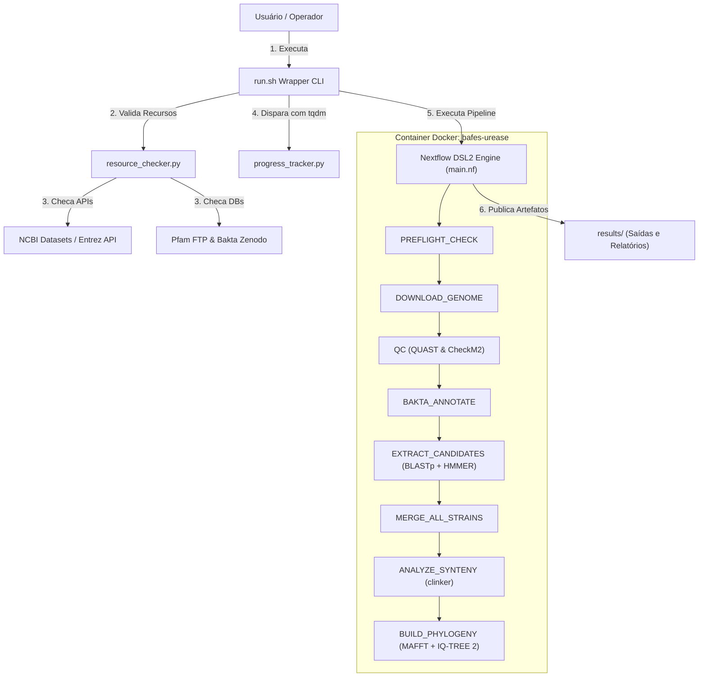
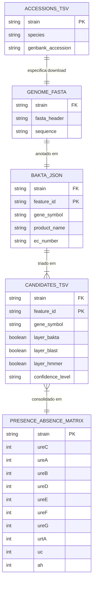

# Baafes-urease-mining

[](README.md)
[](README.en.md)

> 🌐 **Alternar Idioma / Language Switch**: Leia esta documentação em [English-US](README.en.md).

---

## Resumo do projeto
O **Baafes-urease-mining** é um pipeline automatizado de bioinformática desenvolvido em Nextflow DSL2 e Python 3.11, containerizado via Docker, projetado para realizar a prospecção genômica, identificação funcional e análise evolutiva de genes envolvidos no catabolismo de ureia em genomas bacterianos. 

O foco de aplicação abrange 10 genomas de bactérias aeróbias formadoras de endósporos (AEFB) da coleção CBafes/UnB isoladas de solos do Distrito Federal (acessos GenBank `VKHW00000000.1` a `VKIC00000000.1`). O sistema avalia simultaneamente três frentes metabólicas:
1. **Via Canônica da Urease**: Subunidades catalíticas ($\gamma$ - UreA, $\beta$ - UreB, $\alpha$ - UreC) e proteínas acessórias de maturação (UreD, UreE, UreF, UreG).
2. **Sistema de Transporte Ativo de Ureia**: Complexo ABC $urtABCDE$ (UrtA, UrtB, UrtC, UrtD, UrtE).
3. **Rota Alternativa Independente de Níquel**: Urea carboxilase (`uc`) acoplada à alofanato hidrolase (`ah`).

---

## Quick Start

### Pré-requisitos

Todo o pipeline roda **dentro do container** `bafes-urease`. O host precisa apenas de:

- Docker Engine >= 24.0 (com o usuário no grupo `docker`)
- Git, Bash e `curl`
- Espaço em disco: **~160 GB livres** para o banco completo do Bakta (use `--bakta-db-type light`
  para ~10 GB, ou `--skip-bakta-db` se já tiver o banco)

Nextflow, Bakta, BLAST+, HMMER, MAFFT, trimAl, IQ-TREE, QUAST e clinker vêm todos na imagem —
não é preciso instalar nada disso no host. Para rodar sem Docker (com Conda/Mamba já configurado),
use `--runtime local`.

### Sequência de 3 passos

```bash
# Clonar e habilitar o wrapper
git clone https://github.com/waldeyr/bafes-urease.git
cd bafes-urease
chmod +x run.sh

# Passo A: Bootstrap — constrói a imagem, baixa Pfam e o banco completo do Bakta
#          Leva horas na primeira vez (imagem ~20 min + banco Bakta full ~75 GB).
#          Vindo de uma instalação com a tag antiga `bafes_urease`? Retagueie antes,
#          para não reconstruir a imagem do zero:
#              docker tag bafes_urease bafes-urease && docker rmi bafes_urease
./run.sh --bootstrap --runtime docker --container-image bafes-urease

# Passo B: Build e Pre-flight Check (validação de recursos e acessibilidade)
./run.sh --build --runtime docker --container-image bafes-urease

# Passo C: Execução do pipeline com log detalhado e acompanhamento por tqdm
./run.sh --exec --runtime docker --container-image bafes-urease --verbose
```

O `--bootstrap` é idempotente: cada etapa concluída é pulada nas execuções seguintes.

Cada invocação do `run.sh` devolve o prompt imediatamente e segue rodando em uma sessão `screen`
destacada — veja [Sessão `screen` automática](#7-sessão-screen-automática) para acompanhar o log e
ler o código de saída real. Outras combinações de parâmetros (banco reduzido, retomada de execução
interrompida, caminhos alternativos, execução sem container) estão em
[Instalação e uso](#instalação-e-uso).

---

## Lista de funcionalidades
- **Pre-flight Checks & Validação Prévias de Acesso**: Validação automatizada de acessibilidade e conectividade HTTP/API aos 10 genomas no NCBI, banco Pfam (EMBL-EBI FTP) e banco Bakta (Zenodo) antes do disparo de execuções de alto custo computacional.
- **Aquisição Automática do NCBI**: Download direto dos assemblies FASTA via NCBI Datasets CLI com fallback automático para NCBI Entrez E-utilities.
- **Controle de Qualidade Genômico (QC)**: Avaliação estatística de contiguidade com QUAST (N50, L50, GC%) e completude/contaminação com CheckM2.
- **Anotação Genômica Estrutural e Funcional**: Anotação com Bakta v1.9+ gerando saídas estruturadas JSON, GFF3, FAA e GBFF.
- **Triagem Trifásica de Candidatos**: Consolidação por consenso integrando anotação Bakta (Layer A), BLASTp contra referências curadas (Layer B) e busca de domínios Pfam com HMMER3 (Layer C).
- **Matriz de Presença/Ausência**: Construção automatizada da tabela `urease_presence_absence.tsv` e sumário unificado entre as 10 estirpes.
- **Análise de Vizinhança Gênica (Sintenia)**: Extração da janela genômica de $\pm 10$ kb em torno de $ureC$ e geração de mapa interativo HTML com `clinker`.
- **Reconstrução Filogenética de UreC**: Alinhamento múltiplo com MAFFT, filtragem de posições conservadas com trimAl e inferência de árvore por Máxima Verossimilhança com IQ-TREE 2.
- **Acompanhamento de Progresso por tqdm**: Exibição de barras de progresso interativas gerais e por fase (0 a 100%) através do wrapper `run.sh`.

---

## Arquitetura

### Diagrama de componentes



### Tecnologias e suas versões

| Tecnologia / Ferramenta | Versão | Função no Sistema |
| :--- | :--- | :--- |
| **Linux Ubuntu (Jammy)** | 22.04 LTS | Sistema operacional base do container Docker |
| **Python** | 3.11.x | Linguagem para scripts auxiliares, consolidação e tqdm |
| **Java Runtime Environment**| 17.0+ | Pré-requisito para execução do Nextflow |
| **Nextflow** | >= 24.04.0 | Motor de orquestração de workflows bioinformáticos |
| **Docker** | >= 24.0+ | Engine de containerização e isolamento do ambiente |
| **NCBI Datasets CLI / Entrez** | v2 / E-utils | Download e busca de assemblies no GenBank |
| **Bakta** | >= 1.9.0 | Anotação genômica funcional estruturada |
| **QUAST** | >= 5.2.0 | Avaliação de métricas de contiguidade genômica |
| **CheckM2** | >= 1.0.2 | Avaliação de completude e contaminação bacteriana |
| **BLAST+ (blastp)** | >= 2.14.0 | Alinhamento local contra referências proteicas |
| **HMMER3 (hmmscan)** | >= 3.3.2 | Busca de domínios conservados contra banco Pfam-A |
| **clinker** | >= 0.0.28 | Visualização interativa de sintenia e vizinhança gênica |
| **MAFFT** | >= 7.520 | Alinhamento múltiplo de sequências de aminoácidos |
| **trimAl** | >= 1.4.1 | Remoção de posições mal alinhadas ou gappy |
| **IQ-TREE 2** | >= 2.2.0 | Inferência de árvores filogenéticas por Máxima Verossimilhança |
| **pandas / tqdm / Biopython** | Últimas estáveis | Manipulação de matrizes, barras de progresso e FASTA |

---

## Funcionalidades

### Requisitos

| Funcionalidade | Campo de Formulário / Entrada | Campo de Banco / Arquivo de Saída | Regras Aplicadas |
| :--- | :--- | :--- | :--- |
| **Pre-flight Resource Check** | `--accessions`, `--references` | Console log / `preflight_status.txt` | Testa HTTP Status 200/JSON no NCBI, EBI Pfam e Bakta Zenodo. Aborta com Exit Code 4 se insumo crítico falhar. |
| **Download de Genomas** | `genbank_accession` em `data/accessions.tsv` | `results/00_genomes/{strain}.fna` | Resolve o accession WGS master para o assembly (GCA_/GCF_) e baixa via NCBI Datasets CLI, com fallback para o FTP do assembly. Valida contigs, número de bases e alfabeto. **Falha se o genoma real não for obtido.** |
| **QC de Genomas** | FASTA do genoma baixado | `results/01_qc/quast/` e `checkm2/` | QUAST calcula N50, GC% e comprimento total; CheckM2 estima completude/contaminação a partir do banco baixado no bootstrap. |
| **Anotação com Bakta** | FASTA do genoma + `--bakta_db` | `results/02_bakta/{strain}/` (.json, .gff3, .faa, .gbff) | Atribui identificadores RefSeq/UniRef, termos EC (3.5.1.5, 6.3.4.6, 3.5.1.54) e símbolos gênicos. |
| **Triagem de Candidatos** | Bakta JSON, `urease_references.fasta`, `Pfam-A.hmm` | `results/03_candidates/{strain}_candidates.tsv` | Classifica a evidência em 3 camadas: Bakta (A), BLASTp (B, E-value <= 1e-5 + identidade >= 30% + cobertura >= 50%) e HMMER (C, score de domínio >= 20). Confiança Alta (>=2 camadas), Média (1 camada). |
| **Consolidação de Matriz** | Candidatos TSV de todas as estirpes | `results/04_summary/urease_presence_absence.tsv` | Cria matriz binária (0/1) para os 10 genes alvos ($ureA-G$, $urtA$, $uc$, $ah$) por estirpe. |
| **Análise de Sintenia** | Arquivos GBFF das estirpes | `results/05_synteny/synteny.html` | Executa clinker sobre os GenBank anotados (exige >= 2 genomas). Falha explicitamente se não houver GenBank ou se o clinker falhar — nenhum HTML de placeholder é escrito. |
| **Filogenia de UreC** | UreC selecionado a partir dos TSVs de candidatos | `results/06_phylogeny/ureC.treefile`, `ureC_labels.tsv`, `phylogeny_status.txt` | Usa **apenas** as sequências de UreC identificadas na triagem, não o proteoma inteiro. Exige >= 3 UreC; abaixo disso registra o motivo em `phylogeny_status.txt` e não gera árvore. MAFFT -> trimAl `automated1` -> IQ-TREE 2 (`-m MFP`, 1000 ultrafast bootstraps). |
| **Acompanhamento tqdm** | Execução via `run.sh --exec` | Terminal UI com barras interativas | Renderiza o percentual de conclusão por fase e progresso global. |

---

## Integridade dos dados

O pipeline **não fabrica dados em nenhuma hipótese**. Toda etapa que não consegue produzir
um resultado real a partir dos genomas do NCBI falha explicitamente (exit != 0) em vez de
substituir a saída por um valor plausível. Em particular:

- **Genomas.** Os accessions do estudo são WGS master (ex.: `VKHW00000000.1`) e esses registros
  não contêm sequência — um `efetch` neles devolve zero bytes. O
  [download_genome.py](bin/download_genome.py) resolve o accession para o assembly
  (`GCA_`/`GCF_`) antes de baixar, e valida contigs, número de bases (>= 500 kb) e alfabeto
  nucleotídico. Sem genoma real, a estirpe não segue no pipeline.
- **QC.** CheckM2 é executado de verdade contra seu banco. Não há valores de
  completude/contaminação escritos no código.
- **Anotação.** Sem o banco do Bakta, [BAKTA_ANNOTATE](main.nf) falha. Não há anotação
  substituta com genes inventados.
- **Referências.** As sequências de [urease_references.fasta](data/urease_references.fasta) são
  baixadas do UniProt por uma consulta REST: proteínas de urease (`protein_name:urease`) de
  Firmicutes (`taxonomy_id:1239`) revisadas (Swiss-Prot). Nada é sintetizado localmente — falha
  de rede, resposta truncada ou conjunto vazio abortam sem escrever o FASTA. Regenere com:
  ```bash
  python3 bin/fetch_references.py
  ```
- **Sintenia e filogenia.** Nenhum HTML de placeholder e nenhuma árvore parcial. Quando há
  menos de 3 sequências de UreC, isso é registrado em `phylogeny_status.txt` como resultado
  legítimo — não há árvore possível — e nenhum arquivo de árvore é escrito.

### Conjunto de referências

| Item | Valor |
| :--- | :--- |
| Consulta | `(protein_name:urease) AND (taxonomy_id:1239) AND (reviewed:true)` |
| Endpoint | `https://rest.uniprot.org/uniprotkb/stream` (FASTA comprimido) |
| Escopo | Proteínas de urease (por `protein_name`) de Firmicutes, revisadas (Swiss-Prot) |
| Piso de sanidade | 100 sequências; abaixo disso a resposta é tratada como truncada e aborta |
| Procedência | `data/urease_references.provenance.txt` — release, data, contagem e `sha256` |

O conjunto é **vivo**: acompanha o UniProt e muda a cada release (na release 2026_02 são 218
sequências). A reprodutibilidade não vem de uma lista fixa de accessions, e sim do registro de
procedência gravado ao lado do FASTA. Para fixar um recorte diferente, use `--query` ou `--url`:

```bash
python3 bin/fetch_references.py --query '(urease AND (taxonomy_id:1386)) AND (reviewed:true)'
```

---

## Instalação e uso

### Pré-requisitos

Os mesmos do [Quick Start](#quick-start): Docker Engine >= 24.0 com o usuário no grupo `docker`,
Git, Bash, `curl` e ~160 GB livres para o banco completo do Bakta. Todas as ferramentas
bioinformáticas vêm na imagem.

### 1. Clonar o repositório
```bash
git clone https://github.com/waldeyr/bafes-urease.git
cd bafes-urease
```

### 2. Tornar o script wrapper executável
```bash
chmod +x run.sh
```

### 3. Sequência Quick Start

A sequência recomendada, repetida aqui na íntegra:

```bash
# Passo A: Bootstrap — constrói a imagem, baixa Pfam e o banco completo do Bakta
#          Leva horas na primeira vez (imagem ~20 min + banco Bakta full ~75 GB).
#          Vindo de uma instalação com a tag antiga `bafes_urease`? Retagueie antes,
#          para não reconstruir a imagem do zero:
#              docker tag bafes_urease bafes-urease && docker rmi bafes_urease
./run.sh --bootstrap --runtime docker --container-image bafes-urease

# Passo B: Build e Pre-flight Check (validação de recursos e acessibilidade)
./run.sh --build --runtime docker --container-image bafes-urease

# Passo C: Execução do pipeline com log detalhado e acompanhamento por tqdm
./run.sh --exec --runtime docker --container-image bafes-urease --verbose
```

O `--bootstrap` é idempotente: cada etapa concluída é pulada nas execuções seguintes.

### 4. Outras combinações de parâmetros

Os três modos (`--bootstrap`, `--build`, `--exec`) aceitam as mesmas opções, e os padrões já
correspondem ao Quick Start (`--runtime docker`, `--container-image bafes-urease`,
`--bakta-db-type full`). Os exemplos abaixo cobrem os desvios mais comuns.

**Bootstrap com banco reduzido** — quando não há ~160 GB livres; o Bakta light ocupa ~10 GB e
anota menos identificadores RefSeq/UniRef:

```bash
./run.sh --bootstrap --bakta-db-type light
```

**Bootstrap reaproveitando um banco Bakta já existente no host** — evita baixar 75 GB de novo
apontando para a cópia que você já tem:

```bash
./run.sh --bootstrap --skip-bakta-db --bakta-db /dados/bakta/db
./run.sh --exec      --bakta-db /dados/bakta/db --verbose
```

**Bootstrap forçando a reconstrução da imagem** — depois de editar o `Dockerfile` ou o
`environment.yml`:

```bash
./run.sh --bootstrap --force-rebuild
```

**Conferir e atualizar bancos desatualizados** — sem `--update-db` o bootstrap apenas avisa da
divergência de versão e mantém a cópia local:

```bash
./run.sh --bootstrap --update-db
```

**Encadear build e execução propagando o código de saída** — `--wait` bloqueia até o fim de cada
fase, de modo que o `&&` só dispara se a anterior tiver saído com 0:

```bash
./run.sh --build --wait && ./run.sh --exec --wait --verbose
```

**Depurar em primeiro plano** — sem sessão `screen`, com a saída direto no terminal:

```bash
./run.sh --exec --no-screen --verbose
```

**Retomar uma execução interrompida** — reaproveita o cache do Nextflow em vez de refazer as
fases já concluídas:

```bash
./run.sh --exec --resume --verbose
```

**Rodar um subconjunto de estirpes em um diretório separado** — útil para testar o pipeline com
1 ou 2 genomas antes da rodada completa, sem sobrescrever `results/`:

```bash
head -3 data/accessions.tsv > data/accessions_teste.tsv
./run.sh --exec --accessions data/accessions_teste.tsv --outdir results_teste --verbose
```

**Apontar todos os insumos para caminhos alternativos** — bancos e referências fora do
diretório do projeto (por exemplo, em um volume compartilhado):

```bash
./run.sh --exec \
  --accessions /dados/bafes/accessions.tsv \
  --references /dados/bafes/urease_references.fasta \
  --pfam       /dados/bancos/Pfam-A.hmm \
  --bakta-db   /dados/bancos/bakta/db \
  --outdir     /dados/bafes/results \
  --verbose
```

**Executar sem Docker** — exige Conda/Mamba já configurado com as ferramentas no host:

```bash
./run.sh --exec --runtime local --verbose
```

**Executar com Singularity/Apptainer** — em clusters HPC onde o Docker não está disponível:

```bash
./run.sh --exec --runtime singularity --container-image bafes-urease --verbose
```

**Rodada completa não supervisionada** — banco reduzido, tudo em primeiro plano e encadeado,
adequada para disparar dentro de um job de fila:

```bash
./run.sh --bootstrap --bakta-db-type light --no-screen \
  && ./run.sh --build --no-screen \
  && ./run.sh --exec --no-screen --verbose
```

### 5. Opções disponíveis

| Opção | Efeito |
| :--- | :--- |
| `--bootstrap` | Prepara insumos, imagem e bancos (idempotente) |
| `--build` | Valida ambiente e recursos (pre-flight check) |
| `--exec` | Executa o pipeline Nextflow |
| `--verbose` | Ativa relatórios e logs detalhados |
| `--resume` | Retoma execução interrompida aproveitando o cache do Nextflow |
| `--force-rebuild` | Reconstrói a imagem Docker mesmo que ela já exista |
| `--bakta-db-type full\|light` | Banco completo (~75 GB, padrão) ou reduzido (~10 GB) |
| `--skip-bakta-db` | Não baixa o banco do Bakta (use se já tiver um em `--bakta-db`) |
| `--update-db` | Rebaixa os bancos cuja versão divergiu da disponível (sem ele, só avisa) |
| `--runtime docker\|singularity\|local` | Motor de execução (padrão: `docker`) |
| `--container-image IMAGE` | Tag da imagem do container (padrão: `bafes-urease`) |
| `--no-screen` | Executa em primeiro plano, sem criar sessão |
| `--wait` | Bloqueia até a sessão terminar e propaga o código de saída real |
| `--accessions PATH` | Caminho do `accessions.tsv` (padrão: `data/accessions.tsv`) |
| `--references PATH` | Caminho do FASTA de referências (padrão: `data/urease_references.fasta`) |
| `--pfam PATH` | Caminho do `Pfam-A.hmm` (padrão: `Pfam-A.hmm`) |
| `--bakta-db PATH` | Caminho do banco Bakta (padrão: `db/db`) |
| `--outdir PATH` | Diretório de resultados (padrão: `results`) |
| `-h`, `--help` | Exibe a mensagem de ajuda |

### 6. Verificação de versão dos bancos

Os bancos não são só verificados por existência — a versão instalada também é conferida. Isso
importa porque as URLs de origem são **rolantes**: `Pfam/current_release` serve releases
diferentes ao longo do tempo, então "o arquivo existe" não diz *qual* release está no disco.

O `run.sh` registra a versão baixada em `db/.versions/` e a compara com a disponível:

| Banco | Versão local | Versão disponível |
| :--- | :--- | :--- |
| Pfam | `db/.versions/pfam` (release gravada no download) | `Pfam.version.gz` no EMBL-EBI |
| Bakta | `major.minor` do `version.json` + tipo em `db/.versions/bakta_type` | `bakta_db list` |
| CheckM2 | nome do DIAMOND db (ex.: `uniref100.KO.1.dmnd`) | sem índice consultável |
| AMRFinderPlus | alvo do symlink `amrfinderplus-db/latest` | consultada pelo `amrfinder_update` |
| Referências UniProt | `uniprot_release` em `data/urease_references.provenance.txt` | cabeçalho `x-uniprot-release` da API REST |

**Nada é rebaixado enquanto o banco existir**, nem quando a versão diverge: o `--bootstrap`
apenas avisa e mantém a cópia local. Rebaixar o Bakta full são ~75 GB e horas de rede, então a
atualização é sempre explícita, via `--update-db`. Sem rede para consultar a versão remota, a
cópia local é mantida sem erro.

As referências do UniProt vêm de uma consulta **viva** (`fetch_references.py`), cujo conjunto muda
a cada release. Por isso o que identifica o FASTA local é a release gravada em
`data/urease_references.provenance.txt` — junto da contagem e do `sha256`. Um FASTA gerado antes
desse registro fica sem release conhecida: o `--bootstrap` avisa e mantém o arquivo.

Ao atualizar (Bakta e CheckM2), o banco atual é movido para `.old` e só descartado depois que o
novo chega inteiro; se o download falhar, o banco que já funcionava é restaurado em vez de perdido.

```bash
# Confere versões e atualiza só o que divergiu
./run.sh --bootstrap --update-db
```

### 7. Sessão `screen` automática

Toda invocação do `run.sh` cria a sua própria sessão `screen` **destacada** e devolve o prompt
imediatamente, de modo que uma queda de SSH não interrompa a execução — relevante porque o
bootstrap leva horas e o `--exec` mais ainda.

```
>>> Sessão / Session : bafes-bootstrap (screen)
>>> Reanexar / Attach: screen -r bafes-bootstrap        (solte com Ctrl-A D)
>>> Log              : .logs/bootstrap-20260727-1430.log
>>> Código de saída  : .logs/bootstrap-20260727-1430.exitcode
```

**Atenção ao código de saída.** Como a execução segue em segundo plano, a invocação externa
retorna `0` mesmo que o pipeline falhe. O código real é gravado no arquivo `.exitcode`. Para
encadear comandos ou automatizar, use `--wait`, que bloqueia até o fim e propaga o código:

```bash
./run.sh --build --runtime docker --wait && ./run.sh --exec --runtime docker --wait
```

Se `screen` não existir, o `run.sh` tenta `tmux`; sem nenhum dos dois, executa em primeiro plano
com um aviso. Uma segunda invocação da mesma fase é recusada (exit 8) em vez de duplicar a sessão.

### 8. Problema comum: `permission denied` no socket do Docker

Se o comando funciona num terminal novo mas falha dentro de uma sessão `screen` antiga, a causa
não é o Docker. Os grupos suplementares de um processo são fixados no login por `setgroups()` e
nunca são relidos de `/etc/group`; uma sessão criada **antes** do `usermod -aG docker` carrega o
conjunto antigo, e todo shell dentro dela herda essa defasagem. O `run.sh` detecta essa situação
e se reexecuta via `sg docker`, que relê `/etc/group` — não é preciso matar a sessão.

Se ainda assim falhar, o usuário realmente não está no grupo. O admin precisa rodar
`sudo usermod -aG docker $USER`, e você deve abrir uma sessão SSH nova.

### 9. Configuração via `.env`

Copie o modelo e preencha. O `run.sh` carrega o `.env` automaticamente e repassa as
variáveis para dentro do container. O `.env` está no `.gitignore` — **nunca versione sua chave**.

```bash
cp .env.example .env
```

| Variável | Efeito |
| :--- | :--- |
| `NCBI_API_KEY` | Eleva o limite do E-utilities de 3 para 10 req/s. **Recomendado**: sem ela, o pre-check dos 10 accessions e o download dos genomas ficam limitados a 3 req/s e mais sujeitos a HTTP 429. Gere em [account.ncbi.nlm.nih.gov](https://account.ncbi.nlm.nih.gov/) → Account Settings → API Key Management |
| `NCBI_EMAIL` | E-mail de contato exigido pela política do NCBI E-utilities |
| `BAFES_INSECURE_SSL=1` | Desabilita a verificação TLS (só para redes com proxy TLS interceptador) |

### 10. Execução Direta via Nextflow (Opcional)

Requer Nextflow e as ferramentas no host, ou o perfil `docker` (um container por processo):

```bash
nextflow run main.nf \
   --accessions data/accessions.tsv \
   --bakta_db ./db/db \
   --pfam_hmm ./Pfam-A.hmm \
   --references data/urease_references.fasta \
   --outdir results \
   -profile docker
```

Os relatórios (`nf_report.html`, `nf_trace.txt`, `nf_timeline.html`, `nf_dag.html`) já vêm
habilitados no `nextflow.config` — não é preciso passar as flags `-with-*`.

### 11. Estrutura de Saídas Geradas
```
results/
├── 00_preflight/    # Status dos testes de validação prévia
├── 00_genomes/      # Assemblies FASTA baixados do NCBI
├── 01_qc/           # Relatórios de QC (QUAST + CheckM2)
├── 02_bakta/        # Anotações em GFF3, FAA, JSON, GBFF por estirpe
├── 03_candidates/   # Candidatos consolidados por estirpe (Bakta + BLASTp + HMMER)
├── 04_summary/      # Matriz urease_presence_absence.tsv e resumo unificado
├── 05_synteny/      # Visualizador interativo de sintenia (synteny.html)
└── 06_phylogeny/    # Árvore filogenética de UreC (ureC.treefile e alinhamentos)
```

---

## Banco de dados e dicionário de dados

### Diagrama de banco de dados
O pipeline utiliza arquivos tabulares delimitados por tabulação (`.tsv`), documentos estruturados JSON, alinhamentos FASTA e visualizadores HTML persistidos no sistema de arquivos estruturado em diretórios:



### Dicionário de dados

#### Tabela: `data/accessions.tsv`
| Campo | Tipo | Descrição |
| :--- | :--- | :--- |
| `strain` | String (PK) | Identificador único curto da estirpe bacteriana (ex.: S1, S2) |
| `species` | String | Binômio da espécie bacteriana (ex.: Lysinibacillus fusiformis) |
| `genbank_accession` | String | Código de acesso do assembly no GenBank (ex.: VKHW00000000.1) |

#### Tabela: `results/03_candidates/{strain}/{strain}_candidates.tsv`
| Campo | Tipo | Descrição |
| :--- | :--- | :--- |
| `strain` | String (FK) | Identificador da estirpe bacteriana |
| `feature_id` | String (PK) | Código identificador do gene/proteína anotado no Bakta |
| `gene` | String | Símbolo atribuído ao gene (ex.: ureC, urtA, uc) |
| `product` | String | Descrição funcional da proteína |
| `layer_bakta` | Boolean | Sinalização de detecção na Camada A (Bakta) |
| `layer_blast` | Boolean | Sinalização de detecção na Camada B (BLASTp) |
| `layer_hmmer` | Boolean | Sinalização de detecção na Camada C (Pfam HMMER) |
| `confidence` | String | Grau de confiança derivado do consenso (Alta, Media, Baixa) |

#### Tabela: `results/04_summary/urease_presence_absence.tsv`
| Campo | Tipo | Descrição |
| :--- | :--- | :--- |
| `strain` | String (PK) | Identificador único da estirpe |
| `ureC` | Integer (0/1) | Presença (1) ou ausência (0) da subunidade $\alpha$ da urease |
| `ureA` | Integer (0/1) | Presença (1) ou ausência (0) da subunidade $\gamma$ da urease |
| `ureB` | Integer (0/1) | Presença (1) ou ausência (0) da subunidade $\beta$ da urease |
| `ureD` | Integer (0/1) | Presença (1) ou ausência (0) da proteína acessória UreD |
| `ureE` | Integer (0/1) | Presença (1) ou ausência (0) da proteína acessória UreE |
| `ureF` | Integer (0/1) | Presença (1) ou ausência (0) da proteína acessória UreF |
| `ureG` | Integer (0/1) | Presença (1) ou ausência (0) da GTPase acessória UreG |
| `urtA` | Integer (0/1) | Presença (1) ou ausência (0) do transportador de ureia UrtA |
| `uc` | Integer (0/1) | Presença (1) ou ausência (0) da urea carboxilase |
| `ah` | Integer (0/1) | Presença (1) ou ausência (0) da alofanato hidrolase |
