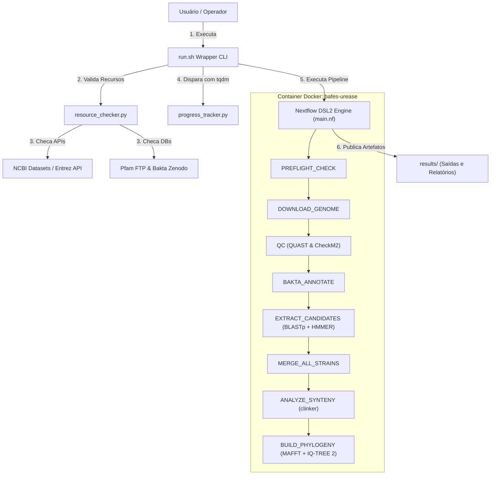
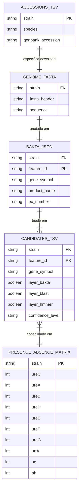

# BAFES-urease-mining

[](README.md)
[](README.en.md)

> 🌐 **Alternar Idioma / Language Switch**: Leia esta documentação em [English-US](README.en.md).

---

## Resumo do projeto
O **BAFES-urease-mining** é um pipeline automatizado de bioinformática desenvolvido em Nextflow DSL2 e Python 3.11, containerizado via Docker, projetado para realizar a prospecção genômica, identificação funcional e análise evolutiva de genes envolvidos no catabolismo de ureia em genomas bacterianos. 

O pipeline analisa a lista de genomas que você fornecer — accessions do GenBank/RefSeq e, opcionalmente, assemblies FASTA locais (ver [Genomas de entrada](#genomas-de-entrada)) — e avalia em cada um três frentes metabólicas:
1. **Via Canônica da Urease**: Subunidades catalíticas ($\gamma$ - UreA, $\beta$ - UreB, $\alpha$ - UreC) e proteínas acessórias de maturação (UreD, UreE, UreF, UreG).
2. **Sistema de Transporte Ativo de Ureia**: Complexo ABC $urtABCDE$ (UrtA, UrtB, UrtC, UrtD, UrtE).
3. **Rota Alternativa Independente de Níquel**: Urea carboxilase (`uc`) acoplada à alofanato hidrolase (`ah`).

**Conjunto de exemplo.** O repositório vem configurado com o conjunto que motivou o projeto: 10
genomas de **BAFES** (Bactérias Aeróbicas Formadoras de Endósporos) da coleção CBAFES/UnB,
isolados de solos do Distrito Federal (accessions `VKHW00000000.1` a `VKIC00000000.1`, em
[data/accessions.tsv](data/accessions.tsv)). Ao longo deste README, números e nomes de estirpes
(S1, S2–S10) se referem a esse conjunto e servem só de ilustração.

### Genomas de entrada

O pipeline roda sobre os genomas listados em até dois arquivos TSV, com cabeçalho e separados por
tabulação:

| Arquivo | Opção | Colunas | Para quê |
| :--- | :--- | :--- | :--- |
| `accessions.tsv` | `--accessions` (padrão: `data/accessions.tsv`) | `strain`, `species`, `genbank_accession` | Genomas públicos, baixados do NCBI. Aceita assembly (`GCA_`/`GCF_`) ou WGS master (`VKHW00000000.1`), que é resolvido para o assembly antes do download. |
| TSV de genomas locais | `--local-genomes` (opcional) | `strain`, `species`, `fasta` | Assemblies que não estão no NCBI. O caminho do FASTA é relativo ao diretório de lançamento; o genoma pula o download e entra direto no QC e no Bakta. Exemplo: [data/local_genomes.tsv](data/local_genomes.tsv). |

Regras:

- `strain` é o identificador curto que nomeia todas as saídas (`results/00_genomes/{strain}.fna`,
  `{strain}_candidates.tsv`, …). Ele não pode se repetir, nem dentro de um arquivo nem entre os
  dois: um ID repetido aborta a execução antes de qualquer tarefa.
- `species` é informativo (aparece no relatório); pode ser `Unknown`.
- Todo genoma, baixado ou local, passa pela mesma validação: contigs, >= 500 kb e alfabeto
  nucleotídico. Um genoma inválido ou que não baixa interrompe a execução inteira (a estratégia
  de erro padrão do Nextflow); corrija ou remova a linha e retome com `--resume`.
- O pre-check exige pelo menos um accession em `accessions.tsv`.

```bash
# Outros genomas públicos
./run.sh --exec --accessions minha_lista.tsv --outdir results_minha_lista --verbose

# Genomas públicos + assemblies locais
./run.sh --exec --accessions minha_lista.tsv --local-genomes meus_fastas.tsv --verbose
```

Duas coisas dependem do grupo taxonômico dos genomas de entrada:

- **Referências do BLASTp.** O conjunto padrão é de Firmicutes, o filo do conjunto de exemplo.
  Para genomas de outros grupos, troque o recorte com `fetch_references.py --query` (ver
  [Conjunto de referências](#conjunto-de-referências)).
- **Recursos.** O tempo cresce com o número de genomas. Os limites de CPU e memória do
  [nextflow.config](nextflow.config) foram dimensionados para um host de 96 núcleos: assim, até
  10 estirpes passam pelo hmmscan numa só leva.
---

## Quick Start

### Pré-requisitos

Todo o pipeline roda **dentro do container** `bafes-urease`. O host precisa apenas de:

- Docker Engine >= 24.0 (com o usuário no grupo `docker`)
- Git, Bash e `curl`
- Espaço em disco: **~160 GB livres** para o banco completo do Bakta (use `--bakta-db-type light`
  para ~10 GB, ou `--skip-bakta-db` se já tiver o banco)

Nextflow, Bakta, BLAST+, HMMER, MAFFT, trimAl, IQ-TREE, QUAST e clinker vêm todos na imagem —
não é preciso instalar nada disso no host. Para rodar sem Docker (com Conda/Mamba já configurado),
use `--runtime local`.

### Sequência de 3 passos

```bash
# Clonar e habilitar o wrapper
git clone https://github.com/waldeyr/bafes-urease.git
cd bafes-urease
chmod +x run.sh

# Passo A: Bootstrap — constrói a imagem, baixa Pfam e o banco completo do Bakta
#          Leva horas na primeira vez (imagem ~20 min + banco Bakta full ~75 GB).
#          Vindo de uma instalação com a tag antiga `bafes_urease`? Retagueie antes,
#          para não reconstruir a imagem do zero:
#              docker tag bafes_urease bafes-urease && docker rmi bafes_urease
./run.sh --bootstrap --runtime docker --container-image bafes-urease

# Passo B: Build e Pre-flight Check (validação de recursos e acessibilidade)
./run.sh --build --runtime docker --container-image bafes-urease

# Passo C: Execução do pipeline com log detalhado e acompanhamento por tqdm
./run.sh --exec --runtime docker --container-image bafes-urease --verbose
```

O `--bootstrap` é idempotente: cada etapa concluída é pulada nas execuções seguintes.

Cada invocação do `run.sh` devolve o prompt imediatamente e segue rodando em uma sessão `screen`
destacada — veja [Sessão `screen` automática](#7-sessão-screen-automática) para acompanhar o log e
ler o código de saída real. Outras combinações de parâmetros (banco reduzido, retomada de execução
interrompida, caminhos alternativos, execução sem container) estão em
[Instalação e uso](#instalação-e-uso).

---

## Lista de funcionalidades
- **Pre-flight Checks & Validação Prévias de Acesso**: Validação automatizada de acessibilidade e conectividade HTTP/API aos accessions de entrada no NCBI, banco Pfam (EMBL-EBI FTP) e banco Bakta (Zenodo) antes do disparo de execuções de alto custo computacional.
- **Aquisição Automática do NCBI**: Download direto dos assemblies FASTA via NCBI Datasets CLI com fallback automático para NCBI Entrez E-utilities; assemblies locais entram com `--local-genomes`, validados pelo mesmo critério.
- **Controle de Qualidade Genômico (QC)**: Avaliação estatística de contiguidade com QUAST (N50, L50, GC%) e completude/contaminação com CheckM2.
- **Anotação Genômica Estrutural e Funcional**: Anotação com Bakta v1.9+ gerando saídas estruturadas JSON, GFF3, FAA e GBFF.
- **Triagem Trifásica de Candidatos**: Consolidação por consenso integrando anotação Bakta (Layer A), BLASTp contra referências do UniProt (Layer B) e busca de domínios Pfam com HMMER3 (Layer C).
- **Matriz de Presença/Ausência**: Construção automatizada da tabela `urease_presence_absence.tsv` e sumário unificado entre todas as estirpes de entrada.
- **Análise de Vizinhança Gênica (Sintenia)**: Extração da janela genômica de $\pm 10$ kb em torno de $ureC$ e geração de mapa interativo HTML com `clinker`.
- **Reconstrução Filogenética de UreC**: Alinhamento múltiplo com MAFFT, filtragem de posições conservadas com trimAl e inferência de árvore por Máxima Verossimilhança com IQ-TREE 2.
- **Acompanhamento de Progresso por tqdm**: Exibição de barras de progresso interativas gerais e por fase (0 a 100%) através do wrapper `run.sh`.

---

## Arquitetura

### Diagrama de componentes


```mermaid
graph TD
    User["Usuário / Operador"] -->|1. Executa| RunWrapper["run.sh Wrapper CLI"]
    RunWrapper -->|2. Valida Recursos| ResourceChecker["resource_checker.py"]
    ResourceChecker -->|3. Checa APIs| NCBI_API["NCBI Datasets / Entrez API"]
    ResourceChecker -->|3. Checa DBs| ExternalDBs["Pfam FTP & Bakta Zenodo"]
    
    RunWrapper -->|4. Dispara com tqdm| ProgressTracker["progress_tracker.py"]
    RunWrapper -->|5. Executa Pipeline| NextflowEngine["Nextflow DSL2 Engine (main.nf)"]
    
    subgraph Container_bafes_urease ["Container Docker: bafes-urease"]
        NextflowEngine --> P0["PREFLIGHT_CHECK"]
        P0 --> P1["DOWNLOAD_GENOME"]
        P1 --> P2["QC (QUAST & CheckM2)"]
        P2 --> P3["BAKTA_ANNOTATE"]
        P3 --> P4["EXTRACT_CANDIDATES (BLASTp + HMMER)"]
        P4 --> P5["MERGE_ALL_STRAINS"]
        P5 --> P6["ANALYZE_SYNTENY (clinker)"]
        P6 --> P7["BUILD_PHYLOGENY (MAFFT + IQ-TREE 2)"]
    end

    NextflowEngine -->|6. Publica Artefatos| ResultsFolder["results/ (Saídas e Relatórios)"]
```

### Tecnologias e suas versões

| Tecnologia / Ferramenta | Versão | Função no Sistema |
| :--- | :--- | :--- |
| **Linux Ubuntu (Jammy)** | 22.04 LTS | Sistema operacional base do container Docker |
| **Python** | 3.11.x | Linguagem para scripts auxiliares, consolidação e tqdm |
| **Java Runtime Environment**| 17.0+ | Pré-requisito para execução do Nextflow |
| **Nextflow** | >= 24.04.0 | Motor de orquestração de workflows bioinformáticos |
| **Docker** | >= 24.0+ | Engine de containerização e isolamento do ambiente |
| **NCBI Datasets CLI / Entrez** | v2 / E-utils | Download e busca de assemblies no GenBank |
| **Bakta** | >= 1.9.0 | Anotação genômica funcional estruturada |
| **QUAST** | >= 5.2.0 | Avaliação de métricas de contiguidade genômica |
| **CheckM2** | >= 1.0.2 | Avaliação de completude e contaminação bacteriana |
| **BLAST+ (blastp)** | >= 2.14.0 | Alinhamento local contra referências proteicas |
| **HMMER3 (hmmscan)** | >= 3.3.2 | Busca de domínios conservados contra banco Pfam-A |
| **clinker** | >= 0.0.28 | Visualização interativa de sintenia e vizinhança gênica |
| **MAFFT** | >= 7.520 | Alinhamento múltiplo de sequências de aminoácidos |
| **trimAl** | >= 1.4.1 | Remoção de posições mal alinhadas ou gappy |
| **IQ-TREE 2** | >= 2.2.0 | Inferência de árvores filogenéticas por Máxima Verossimilhança |
| **pandas / tqdm / Biopython** | Últimas estáveis | Manipulação de matrizes, barras de progresso e FASTA |

---

## Funcionalidades

### Requisitos

| Funcionalidade | Campo de Formulário / Entrada | Campo de Banco / Arquivo de Saída | Regras Aplicadas |
| :--- | :--- | :--- | :--- |
| **Pre-flight Resource Check** | `--accessions`, `--references` | Console log / `preflight_status.txt` | Testa HTTP Status 200/JSON no NCBI, EBI Pfam e Bakta Zenodo. Aborta com Exit Code 4 se insumo crítico falhar. |
| **Download de Genomas** | `genbank_accession` em `data/accessions.tsv`; `fasta` no TSV de `--local-genomes` | `results/00_genomes/{strain}.fna` | Resolve o accession WGS master para o assembly (GCA_/GCF_) e baixa via NCBI Datasets CLI, com fallback para o FTP do assembly. Genomas locais pulam o download. Todos são validados (contigs, número de bases e alfabeto). **Falha se o genoma real não for obtido.** |
| **QC de Genomas** | FASTA do genoma baixado | `results/01_qc/quast/` e `checkm2/` | QUAST calcula N50, GC% e comprimento total; CheckM2 estima completude/contaminação a partir do banco baixado no bootstrap. |
| **Anotação com Bakta** | FASTA do genoma + `--bakta_db` | `results/02_bakta/{strain}/` (.json, .gff3, .faa, .gbff) | Atribui identificadores RefSeq/UniRef, termos EC (3.5.1.5, 6.3.4.6, 3.5.1.54) e símbolos gênicos. |
| **Triagem de Candidatos** | Bakta JSON, `urease_references.fasta`, `Pfam-A.hmm` | `results/03_candidates/{strain}_candidates.tsv` | Classifica a evidência em 3 camadas: Bakta (A), BLASTp (B, E-value <= 1e-5 + identidade >= 30% + cobertura >= 50%) e HMMER (C, score de domínio >= 20). Confiança pela [pontuação](#pontuação-da-triagem-de-candidatos): Alta (>= 2 pontos), Média (1), Baixa (só BLASTp contra TrEMBL). |
| **Consolidação de Matriz** | Candidatos TSV de todas as estirpes | `results/04_summary/urease_presence_absence.tsv` | Cria matriz binária (0/1) para os 11 genes alvo ($ureA$–$ureH$, $urtA$, $uc$, $ah$) por estirpe. |
| **Análise de Sintenia** | Arquivos GBFF das estirpes | `results/05_synteny/synteny.html` | Executa clinker sobre os GenBank anotados (exige >= 2 genomas). Falha explicitamente se não houver GenBank ou se o clinker falhar — nenhum HTML de placeholder é escrito. |
| **Filogenia de UreC** | UreC selecionado a partir dos TSVs de candidatos | `results/06_phylogeny/ureC.treefile`, `ureC_labels.tsv`, `phylogeny_status.txt` | Usa **apenas** as sequências de UreC identificadas na triagem, não o proteoma inteiro, mais as UreC de referência e o grupo externo (`data/urec_outgroup.fasta`). Exige >= 3 UreC; abaixo disso registra o motivo em `phylogeny_status.txt` e não gera árvore. MAFFT -> trimAl `automated1` -> IQ-TREE 2 (`-m MFP`, 1000 ultrafast bootstraps, enraizada no grupo externo com `-o`). |
| **Acompanhamento tqdm** | Execução via `run.sh --exec` | Terminal UI com barras interativas | Renderiza o percentual de conclusão por fase e progresso global. |

### Pontuação da triagem de candidatos

Cada camada vale 1 ponto, com uma exceção: o BLASTp cujo **melhor acerto** é uma referência do
TrEMBL (não revisada) é registrado, mas não pontua. A anotação do TrEMBL é automática, como a do
Bakta, então concordar com ela não é evidência independente. O status do melhor acerto fica na
coluna `blast_ref_status`, e os pontos em `evidence_points`.

| Evidência | Pontos |
| :--- | :--- |
| Camada A — Bakta: gene alvo, número EC ou produto | 1 |
| Camada B — BLASTp com melhor acerto em referência revisada (Swiss-Prot) | 1 |
| Camada B — BLASTp com melhor acerto em referência não revisada (TrEMBL) | 0 (registrado) |
| Camada C — HMMER: perfil Pfam da lista, score de domínio >= 20 | 1 |

| Pontos | Confiança |
| :--- | :--- |
| >= 2 | Alta |
| 1 | Média |
| 0, com BLASTp contra TrEMBL | Baixa |

| Exemplo | Pontos | Confiança |
| :--- | :--- | :--- |
| Bakta + BLASTp (Swiss-Prot) + HMMER | 3 | Alta |
| Bakta + BLASTp (Swiss-Prot) | 2 | Alta |
| Bakta + HMMER + BLASTp (TrEMBL) | 2 | Alta |
| Bakta + BLASTp (TrEMBL) | 1 | Média |
| HMMER + BLASTp (TrEMBL) | 1 | Média |
| Só Bakta, ou só HMMER | 1 | Média |
| Só BLASTp (TrEMBL) | 0 | Baixa |

Hoje só UrtA–E, `uca` e `atzF` vêm do TrEMBL. UrtA–E e `atzF` não têm perfil na lista da Camada
C, então na prática chegam no máximo a Média. A urea carboxilase (`uca`) carrega o domínio CT_C_D
(PF02682), que está na lista, e por isso ainda alcança Alta com Bakta + HMMER. Um FASTA de referências próprio (`--references`)
cujo cabeçalho não siga o formato `ref|gene|UniProt:acesso|organismo|status|Naa` recebe status
`unknown` e pontua como revisado.

---

## Integridade dos dados

O pipeline **não fabrica dados em nenhuma hipótese**. Toda etapa que não consegue produzir
um resultado real a partir dos genomas de entrada falha explicitamente (exit != 0) em vez de
substituir a saída por um valor plausível. Em particular:

- **Genomas.** Accessions WGS master (como os do conjunto de exemplo, `VKHW00000000.1`) não
  contêm sequência — um `efetch` neles devolve zero bytes. O
  [download_genome.py](bin/download_genome.py) resolve o accession para o assembly
  (`GCA_`/`GCF_`) antes de baixar, e valida contigs, número de bases (>= 500 kb) e alfabeto
  nucleotídico. Sem genoma real, a estirpe não segue no pipeline.
- **QC.** CheckM2 é executado de verdade contra seu banco. Não há valores de
  completude/contaminação escritos no código.
- **Anotação.** Sem o banco do Bakta, [BAKTA_ANNOTATE](main.nf) falha. Não há anotação
  substituta com genes inventados.
- **Referências.** As sequências de [urease_references.fasta](data/urease_references.fasta) e do
  grupo externo [urec_outgroup.fasta](data/urec_outgroup.fasta) são baixadas do UniProt por
  consulta REST (detalhes em [Conjunto de referências](#conjunto-de-referências)). Nada é
  sintetizado localmente — falha de rede, resposta truncada ou conjunto vazio abortam sem
  escrever nenhum dos dois arquivos. Regenere com:
  ```bash
  python3 bin/fetch_references.py
  ```
- **Sintenia e filogenia.** Nenhum HTML de placeholder e nenhuma árvore parcial. Quando há
  menos de 3 sequências de UreC, isso é registrado em `phylogeny_status.txt` como resultado
  legítimo — não há árvore possível — e nenhum arquivo de árvore é escrito.

### Conjunto de referências

| Item | Valor |
| :--- | :--- |
| Consulta | `(taxonomy_id:1239) AND (((protein_name:urease) AND (reviewed:true)) OR (gene_exact:urtA OR … OR gene_exact:urtE OR gene_exact:uca OR gene_exact:atzF))` |
| Endpoint | `https://rest.uniprot.org/uniprotkb/stream` (FASTA comprimido) |
| Escopo | Firmicutes. Urease (UreA–I): só revisadas (Swiss-Prot). Transporte (UrtA–E), urea carboxilase (`uca`) e alofanato hidrolase (`atzF`): revisadas ou não (TrEMBL) |
| Redundância | Uma sequência por gene e espécie; a revisada tem preferência, depois a menor acessão (`--keep-redundant` desliga) |
| Piso de sanidade | 100 sequências na resposta bruta; abaixo disso ela é tratada como truncada e aborta |
| Grupo externo | UreC revisadas de *Klebsiella aerogenes* (P18314) e *Proteus mirabilis* (P17086), em `data/urec_outgroup.fasta` — só para a árvore, fora do BLASTp |
| Procedência | `data/urease_references.provenance.txt` e `data/urec_outgroup.provenance.txt` — release, data, contagens e `sha256` |

O conjunto é **vivo**: acompanha o UniProt e muda a cada release (na release 2026_03 são 960
sequências após a deduplicação — 109 revisadas e 851 não revisadas — de 1.074 na resposta). A
reprodutibilidade não vem de uma lista fixa de accessions, e sim do registro de procedência
gravado ao lado do FASTA. Para fixar um recorte diferente, use `--query` ou `--url`:

```bash
python3 bin/fetch_references.py --query '(urease AND (taxonomy_id:1386)) AND (reviewed:true)'
```

---

## Instalação e uso

### Pré-requisitos

Os mesmos do [Quick Start](#quick-start): Docker Engine >= 24.0 com o usuário no grupo `docker`,
Git, Bash, `curl` e ~160 GB livres para o banco completo do Bakta. Todas as ferramentas
bioinformáticas vêm na imagem.

### 1. Clonar o repositório
```bash
git clone https://github.com/waldeyr/bafes-urease.git
cd bafes-urease
```

### 2. Tornar o script wrapper executável
```bash
chmod +x run.sh
```

### 3. Sequência Quick Start

A sequência recomendada, repetida aqui na íntegra:

```bash
# Passo A: Bootstrap — constrói a imagem, baixa Pfam e o banco completo do Bakta
#          Leva horas na primeira vez (imagem ~20 min + banco Bakta full ~75 GB).
#          Vindo de uma instalação com a tag antiga `bafes_urease`? Retagueie antes,
#          para não reconstruir a imagem do zero:
#              docker tag bafes_urease bafes-urease && docker rmi bafes_urease
./run.sh --bootstrap --runtime docker --container-image bafes-urease

# Passo B: Build e Pre-flight Check (validação de recursos e acessibilidade)
./run.sh --build --runtime docker --container-image bafes-urease

# Passo C: Execução do pipeline com log detalhado e acompanhamento por tqdm
./run.sh --exec --runtime docker --container-image bafes-urease --verbose
```

O `--bootstrap` é idempotente: cada etapa concluída é pulada nas execuções seguintes.

### 4. Outras combinações de parâmetros

Os três modos (`--bootstrap`, `--build`, `--exec`) aceitam as mesmas opções, e os padrões já
correspondem ao Quick Start (`--runtime docker`, `--container-image bafes-urease`,
`--bakta-db-type full`). Os exemplos abaixo cobrem os desvios mais comuns.

**Bootstrap com banco reduzido** — quando não há ~160 GB livres; o Bakta light ocupa ~10 GB e
anota menos identificadores RefSeq/UniRef:

```bash
./run.sh --bootstrap --bakta-db-type light
```

**Bootstrap reaproveitando um banco Bakta já existente no host** — evita baixar 75 GB de novo
apontando para a cópia que você já tem:

```bash
./run.sh --bootstrap --skip-bakta-db --bakta-db /dados/bakta/db
./run.sh --exec      --bakta-db /dados/bakta/db --verbose
```

**Bootstrap forçando a reconstrução da imagem** — depois de editar o `Dockerfile` ou o
`environment.yml`:

```bash
./run.sh --bootstrap --force-rebuild
```

**Conferir e atualizar bancos desatualizados** — sem `--update-db` o bootstrap apenas avisa da
divergência de versão e mantém a cópia local:

```bash
./run.sh --bootstrap --update-db
```

**Encadear build e execução propagando o código de saída** — `--wait` bloqueia até o fim de cada
fase, de modo que o `&&` só dispara se a anterior tiver saído com 0:

```bash
./run.sh --build --wait && ./run.sh --exec --wait --verbose
```

**Depurar em primeiro plano** — sem sessão `screen`, com a saída direto no terminal:

```bash
./run.sh --exec --no-screen --verbose
```

**Retomar uma execução interrompida** — reaproveita o cache do Nextflow em vez de refazer as
fases já concluídas:

```bash
./run.sh --exec --resume --verbose
```

**Rodar um subconjunto de estirpes em um diretório separado** — útil para testar o pipeline com
1 ou 2 genomas antes da rodada completa, sem sobrescrever `results/`:

```bash
head -3 data/accessions.tsv > data/accessions_teste.tsv
./run.sh --exec --accessions data/accessions_teste.tsv --outdir results_teste --verbose
```

**Apontar todos os insumos para caminhos alternativos** — bancos e referências fora do
diretório do projeto (por exemplo, em um volume compartilhado):

```bash
./run.sh --exec \
  --accessions /dados/bafes/accessions.tsv \
  --references /dados/bafes/urease_references.fasta \
  --pfam       /dados/bancos/Pfam-A.hmm \
  --bakta-db   /dados/bancos/bakta/db \
  --outdir     /dados/bafes/results \
  --verbose
```

**Executar sem Docker** — exige Conda/Mamba já configurado com as ferramentas no host:

```bash
./run.sh --exec --runtime local --verbose
```

**Executar com Singularity/Apptainer** — em clusters HPC onde o Docker não está disponível:

```bash
./run.sh --exec --runtime singularity --container-image bafes-urease --verbose
```

**Rodada completa não supervisionada** — banco reduzido, tudo em primeiro plano e encadeado,
adequada para disparar dentro de um job de fila:

```bash
./run.sh --bootstrap --bakta-db-type light --no-screen \
  && ./run.sh --build --no-screen \
  && ./run.sh --exec --no-screen --verbose
```

### 5. Opções disponíveis

| Opção | Efeito |
| :--- | :--- |
| `--bootstrap` | Prepara insumos, imagem e bancos (idempotente) |
| `--build` | Valida ambiente e recursos (pre-flight check) |
| `--exec` | Executa o pipeline Nextflow |
| `--verbose` | Ativa relatórios e logs detalhados |
| `--resume` | Retoma execução interrompida aproveitando o cache do Nextflow |
| `--force-rebuild` | Reconstrói a imagem Docker mesmo que ela já exista |
| `--bakta-db-type full\|light` | Banco completo (~75 GB, padrão) ou reduzido (~10 GB) |
| `--skip-bakta-db` | Não baixa o banco do Bakta (use se já tiver um em `--bakta-db`) |
| `--update-db` | Rebaixa os bancos cuja versão divergiu da disponível (sem ele, só avisa) |
| `--runtime docker\|singularity\|local` | Motor de execução (padrão: `docker`) |
| `--container-image IMAGE` | Tag da imagem do container (padrão: `bafes-urease`) |
| `--no-screen` | Executa em primeiro plano, sem criar sessão |
| `--wait` | Bloqueia até a sessão terminar e propaga o código de saída real |
| `--accessions PATH` | Caminho do `accessions.tsv` (padrão: `data/accessions.tsv`) |
| `--local-genomes PATH` | TSV de assemblies FASTA locais (`strain`, `species`, `fasta`), além dos accessions |
| `--references PATH` | Caminho do FASTA de referências (padrão: `data/urease_references.fasta`) |
| `--pfam PATH` | Caminho do `Pfam-A.hmm` (padrão: `Pfam-A.hmm`) |
| `--bakta-db PATH` | Caminho do banco Bakta (padrão: `db/db`) |
| `--outdir PATH` | Diretório de resultados (padrão: `results`) |
| `-h`, `--help` | Exibe a mensagem de ajuda |

### 6. Verificação de versão dos bancos

Os bancos não são só verificados por existência — a versão instalada também é conferida. Isso
importa porque as URLs de origem são **rolantes**: `Pfam/current_release` serve releases
diferentes ao longo do tempo, então "o arquivo existe" não diz *qual* release está no disco.

O `run.sh` registra a versão baixada em `db/.versions/` e a compara com a disponível:

| Banco | Versão local | Versão disponível |
| :--- | :--- | :--- |
| Pfam | `db/.versions/pfam` (release gravada no download) | `Pfam.version.gz` no EMBL-EBI |
| Bakta | `major.minor` do `version.json` + tipo em `db/.versions/bakta_type` | `bakta_db list` |
| CheckM2 | nome do DIAMOND db (ex.: `uniref100.KO.1.dmnd`) | sem índice consultável |
| AMRFinderPlus | alvo do symlink `amrfinderplus-db/latest` | consultada pelo `amrfinder_update` |
| Referências UniProt | `uniprot_release` em `data/urease_references.provenance.txt` | cabeçalho `x-uniprot-release` da API REST |

**Nada é rebaixado enquanto o banco existir**, nem quando a versão diverge: o `--bootstrap`
apenas avisa e mantém a cópia local. Rebaixar o Bakta full são ~75 GB e horas de rede, então a
atualização é sempre explícita, via `--update-db`. Sem rede para consultar a versão remota, a
cópia local é mantida sem erro.

As referências do UniProt vêm de uma consulta **viva** (`fetch_references.py`), cujo conjunto muda
a cada release. Por isso o que identifica o FASTA local é a release gravada em
`data/urease_references.provenance.txt` — junto da contagem e do `sha256`. Um FASTA gerado antes
desse registro fica sem release conhecida: o `--bootstrap` avisa e mantém o arquivo.

Ao atualizar (Bakta e CheckM2), o banco atual é movido para `.old` e só descartado depois que o
novo chega inteiro; se o download falhar, o banco que já funcionava é restaurado em vez de perdido.

```bash
# Confere versões e atualiza só o que divergiu
./run.sh --bootstrap --update-db
```

### 7. Sessão `screen` automática

Toda invocação do `run.sh` cria a sua própria sessão `screen` **destacada** e devolve o prompt
imediatamente, de modo que uma queda de SSH não interrompa a execução — relevante porque o
bootstrap leva horas e o `--exec` mais ainda.

```
>>> Sessão / Session : bafes-bootstrap (screen)
>>> Reanexar / Attach: screen -r bafes-bootstrap        (solte com Ctrl-A D)
>>> Log              : .logs/bootstrap-20260727-1430.log
>>> Código de saída  : .logs/bootstrap-20260727-1430.exitcode
```

**Atenção ao código de saída.** Como a execução segue em segundo plano, a invocação externa
retorna `0` mesmo que o pipeline falhe. O código real é gravado no arquivo `.exitcode`. Para
encadear comandos ou automatizar, use `--wait`, que bloqueia até o fim e propaga o código:

```bash
./run.sh --build --runtime docker --wait && ./run.sh --exec --runtime docker --wait
```

Se `screen` não existir, o `run.sh` tenta `tmux`; sem nenhum dos dois, executa em primeiro plano
com um aviso. Uma segunda invocação da mesma fase é recusada (exit 8) em vez de duplicar a sessão.

### 8. Problema comum: `permission denied` no socket do Docker

Se o comando funciona num terminal novo mas falha dentro de uma sessão `screen` antiga, a causa
não é o Docker. Os grupos suplementares de um processo são fixados no login por `setgroups()` e
nunca são relidos de `/etc/group`; uma sessão criada **antes** do `usermod -aG docker` carrega o
conjunto antigo, e todo shell dentro dela herda essa defasagem. O `run.sh` detecta essa situação
e se reexecuta via `sg docker`, que relê `/etc/group` — não é preciso matar a sessão.

Se ainda assim falhar, o usuário realmente não está no grupo. O admin precisa rodar
`sudo usermod -aG docker $USER`, e você deve abrir uma sessão SSH nova.

### 9. Configuração via `.env`

Copie o modelo e preencha. O `run.sh` carrega o `.env` automaticamente e repassa as
variáveis para dentro do container. O `.env` está no `.gitignore` — **nunca versione sua chave**.

```bash
cp .env.example .env
```

| Variável | Efeito |
| :--- | :--- |
| `NCBI_API_KEY` | Eleva o limite do E-utilities de 3 para 10 req/s. **Recomendado**: sem ela, o pre-check dos accessions e o download dos genomas ficam limitados a 3 req/s e mais sujeitos a HTTP 429. Gere em [account.ncbi.nlm.nih.gov](https://account.ncbi.nlm.nih.gov/) → Account Settings → API Key Management |
| `NCBI_EMAIL` | E-mail de contato exigido pela política do NCBI E-utilities |
| `BAFES_INSECURE_SSL=1` | Desabilita a verificação TLS (só para redes com proxy TLS interceptador) |

### 10. Execução Direta via Nextflow (Opcional)

Requer Nextflow e as ferramentas no host, ou o perfil `docker` (um container por processo):

```bash
nextflow run main.nf \
   --accessions data/accessions.tsv \
   --bakta_db ./db/db \
   --pfam_hmm ./Pfam-A.hmm \
   --references data/urease_references.fasta \
   --outdir results \
   -profile docker
```

Os relatórios (`nf_report.html`, `nf_trace.txt`, `nf_timeline.html`, `nf_dag.html`) já vêm
habilitados no `nextflow.config` — não é preciso passar as flags `-with-*`.

### 11. Estrutura de Saídas Geradas
```
results/
├── 00_preflight/    # Status dos testes de validação prévia
├── 00_genomes/      # Assemblies FASTA baixados do NCBI
├── 01_qc/           # Relatórios de QC (QUAST + CheckM2)
├── 02_bakta/        # Anotações em GFF3, FAA, JSON, GBFF por estirpe
├── 03_candidates/   # Candidatos consolidados por estirpe (Bakta + BLASTp + HMMER)
├── 04_summary/      # Matriz urease_presence_absence.tsv e resumo unificado
├── 05_synteny/      # Visualizador interativo de sintenia (synteny.html)
└── 06_phylogeny/    # Árvore filogenética de UreC (ureC.treefile e alinhamentos)
```

---

## Banco de dados e dicionário de dados

### Diagrama de banco de dados
O pipeline utiliza arquivos tabulares delimitados por tabulação (`.tsv`), documentos estruturados JSON, alinhamentos FASTA e visualizadores HTML persistidos no sistema de arquivos estruturado em diretórios:


```mermaid
erDiagram
    ACCESSIONS_TSV {
        string strain PK
        string species
        string genbank_accession
    }
    GENOME_FASTA {
        string strain FK
        string fasta_header
        string sequence
    }
    BAKTA_JSON {
        string strain FK
        string feature_id PK
        string gene_symbol
        string product_name
        string ec_number
    }
    CANDIDATES_TSV {
        string strain FK
        string feature_id PK
        string gene_symbol
        boolean layer_bakta
        boolean layer_blast
        boolean layer_hmmer
        string confidence_level
    }
    PRESENCE_ABSENCE_MATRIX {
        string strain PK
        int ureC
        int ureA
        int ureB
        int ureD
        int ureE
        int ureF
        int ureG
        int urtA
        int uc
        int ah
    }

    ACCESSIONS_TSV ||--|| GENOME_FASTA : "especifica download"
    GENOME_FASTA ||--|| BAKTA_JSON : "anotado em"
    BAKTA_JSON ||--|{ CANDIDATES_TSV : "triado em"
    CANDIDATES_TSV }|--|| PRESENCE_ABSENCE_MATRIX : "consolidado em"
```

### Dicionário de dados

#### Tabela: `data/accessions.tsv`
| Campo | Tipo | Descrição |
| :--- | :--- | :--- |
| `strain` | String (PK) | Identificador único curto da estirpe bacteriana (ex.: S1, S2) |
| `species` | String | Binômio da espécie bacteriana (ex.: Lysinibacillus fusiformis) |
| `genbank_accession` | String | Accession do assembly (`GCA_`/`GCF_`) ou WGS master no GenBank (ex.: VKHW00000000.1) |

#### Tabela: TSV de `--local-genomes` (ex.: `data/local_genomes.tsv`)
| Campo | Tipo | Descrição |
| :--- | :--- | :--- |
| `strain` | String (PK) | Identificador único curto; não pode repetir um de `accessions.tsv` |
| `species` | String | Binômio da espécie, ou `Unknown` |
| `fasta` | String | Caminho do assembly FASTA, relativo ao diretório de lançamento |

#### Tabela: `results/03_candidates/{strain}/{strain}_candidates.tsv`
| Campo | Tipo | Descrição |
| :--- | :--- | :--- |
| `strain` | String (FK) | Identificador da estirpe bacteriana |
| `feature_id` | String (PK) | Código identificador do gene/proteína anotado no Bakta |
| `gene` | String | Símbolo atribuído ao gene (ex.: ureC, urtA, uc) |
| `product` | String | Descrição funcional da proteína |
| `layer_bakta` | Boolean | Sinalização de detecção na Camada A (Bakta) |
| `layer_blast` | Boolean | Sinalização de detecção na Camada B (BLASTp) |
| `layer_hmmer` | Boolean | Sinalização de detecção na Camada C (Pfam HMMER) |
| `blast_ref_status` | String | Status da referência do melhor acerto de BLASTp: `reviewed` (Swiss-Prot), `unreviewed` (TrEMBL) ou `unknown` |
| `evidence_points` | Integer | Pontos de evidência (ver [Pontuação da triagem de candidatos](#pontuação-da-triagem-de-candidatos)) |
| `confidence` | String | Confiança derivada dos pontos: `Alta/High`, `Media/Medium` ou `Baixa/Low` |

#### Tabela: `results/04_summary/urease_presence_absence.tsv`
| Campo | Tipo | Descrição |
| :--- | :--- | :--- |
| `strain` | String (PK) | Identificador único da estirpe |
| `ureC` | Integer (0/1) | Presença (1) ou ausência (0) da subunidade $\alpha$ da urease |
| `ureA` | Integer (0/1) | Presença (1) ou ausência (0) da subunidade $\gamma$ da urease |
| `ureB` | Integer (0/1) | Presença (1) ou ausência (0) da subunidade $\beta$ da urease |
| `ureD` | Integer (0/1) | Presença (1) ou ausência (0) da proteína acessória UreD |
| `ureE` | Integer (0/1) | Presença (1) ou ausência (0) da proteína acessória UreE |
| `ureF` | Integer (0/1) | Presença (1) ou ausência (0) da proteína acessória UreF |
| `ureG` | Integer (0/1) | Presença (1) ou ausência (0) da GTPase acessória UreG |
| `ureH` | Integer (0/1) | Presença (1) ou ausência (0) da proteína acessória UreH |
| `urtA` | Integer (0/1) | Presença (1) ou ausência (0) do transportador de ureia UrtA |
| `uc` | Integer (0/1) | Presença (1) ou ausência (0) da urea carboxilase |
| `ah` | Integer (0/1) | Presença (1) ou ausência (0) da alofanato hidrolase |

---

## Guia de decisões sobre o pipeline

### Qual banco de dados e por quê?

Cada banco responde a uma pergunta diferente, e a triagem de candidatos usa três fontes
independentes de propósito: uma só (anotação, similaridade ou domínio) não basta para afirmar
presença. Um candidato só é de confiança **Alta** quando pelo menos duas camadas concordam.

| Banco | Etapa | Por quê |
| :--- | :--- | :--- |
| **NCBI GenBank / Assembly** | `DOWNLOAD_GENOME` | Fonte pública dos genomas listados em `accessions.tsv`. Accessions WGS master (como os do conjunto de exemplo, `VKHW00000000.1`) não têm sequência; o [download_genome.py](bin/download_genome.py) os resolve para o assembly `GCA_`/`GCF_` antes de baixar. Genomas locais (`--local-genomes`) não passam por aqui. |
| **CheckM2** (`uniref100.KO.1.dmnd`) | `QC_CHECKM2` | Estima completude e contaminação com um modelo de aprendizado de máquina, sem depender de marcadores específicos de linhagem — adequado a estirpes sem espécie definida, como as *Bacillus* sp. do conjunto de exemplo. |
| **Bakta DB full** | `BAKTA_ANNOTATE` | Anotação bacteriana padronizada. O JSON traz gene, produto, termos EC e `db_xrefs`, que formam a Camada A. A versão *full* (~75 GB) atribui mais identificadores RefSeq/UniRef que a *light*. Inclui o AMRFinderPlus, dependência interna do Bakta — por isso ele aparece na verificação de versões. |
| **UniProtKB** (Swiss-Prot + TrEMBL) | `EXTRACT_CANDIDATES`, Camada B (BLASTp) | Restrito por padrão a **Firmicutes** (`taxonomy_id:1239`), o filo do conjunto de exemplo, o que mantém a identidade alta frente aos limiares de 30 % de identidade e 50 % de cobertura. Para a urease, só entradas **revisadas** (Swiss-Prot), com função verificada por curadoria. Para UrtA–E, `uca` e `atzF` o Swiss-Prot não tem nenhuma entrada de Firmicutes (e nenhuma UrtA–E em organismo algum), então entram as do TrEMBL, buscadas por nome exato de gene. A consulta é viva, com release e `sha256` registrados em [urease_references.provenance.txt](data/urease_references.provenance.txt). |
| **UniProtKB/Swiss-Prot** (grupo externo) | `BUILD_PHYLOGENY` | Duas UreC de Gammaproteobacteria que enraízam a árvore de UreC (ver a pergunta sobre espécies). Ficam em [urec_outgroup.fasta](data/urec_outgroup.fasta), separadas das referências do BLASTp. |
| **Pfam-A** | `EXTRACT_CANDIDATES`, Camada C (hmmscan) | Perfis HMM detectam homologia remota que o BLASTp perde e não dependem da anotação do Bakta. Só 10 perfis contam como evidência (`UREASE_PFAM_ACCESSIONS` em [extract_urease_candidates.py](bin/extract_urease_candidates.py)). PF01979 (Amidohydro_1) e PF00005 (ABC_tran) ficam de fora por cobrirem superfamílias inteiras. |

**Limitação conhecida.** Pfam e Bakta vêm de URLs rolantes: "o arquivo existe" não diz qual
release está no disco. A reprodutibilidade depende das versões gravadas em `db/.versions/` (ver
[Verificação de versão dos bancos](#6-verificação-de-versão-dos-bancos)).

### Qual a ordem de execução e por quê?

O Nextflow executa por fluxo de dados: a "ordem" é a cadeia de dependências, e cada estirpe
avança de forma independente. O diagrama linear da [Arquitetura](#arquitetura) simplifica isso.

1. **`PREFLIGHT_CHECK`** — Testa NCBI, Pfam, Bakta e as referências antes de tudo, para falhar em
   segundos em vez de depois de horas de anotação e hmmscan.
2. **`DOWNLOAD_GENOME` / `STAGE_LOCAL_GENOME`** — Obtém e valida o FASTA (contigs, >= 500 kb,
   alfabeto). Sem genoma real, a estirpe para aqui.
3. **`QC_QUAST` e `QC_CHECKM2`**, em paralelo com **`BAKTA_ANNOTATE`** — O QC é informativo e
   **não filtra** estirpes: o genoma vai direto para o Bakta. Rodar em paralelo evita que o QC
   atrase a etapa mais longa.
4. **`BAKTA_ANNOTATE`** antes da triagem — O BLASTp e o hmmscan rodam sobre o `.faa` gerado pelo
   Bakta. Assim as três camadas falam do mesmo locus tag, e o consenso é feito por identificador.
5. **`EXTRACT_CANDIDATES`** — BLASTp, hmmscan e consolidação das três camadas por estirpe. É o
   gargalo do pipeline (hmmscan contra o Pfam-A inteiro).
6. **`MERGE_ALL_STRAINS`**, **`EXTRACT_LOCUS`** e **`BUILD_PHYLOGENY`** depois da triagem — As
   três consomem os candidatos: a matriz os consolida, o recorte do locus ancora neles e a filogenia
   seleciona o UreC deles, nunca do proteoma inteiro. São independentes entre si.
7. **`EXTRACT_LOCUS`** antes de **`ANALYZE_SYNTENY`** — O clinker alinha todas as proteínas contra
   todas. No conjunto de exemplo, com os 10 genomas inteiros (~46.500 CDS), eram ~10⁹
   alinhamentos e a etapa estourou as 8 h (exit 143). Recortado o locus (±5 genes flanqueadores),
   a etapa leva segundos — e o custo passa a crescer com o tamanho do locus, não do genoma.

### Quais espécies de referência em cada etapa e por quê?

| Etapa | Referência | Por quê |
| :--- | :--- | :--- |
| **Genomas de entrada** | Os listados em `accessions.tsv` e no TSV de `--local-genomes`. No conjunto de exemplo: S1 *Lysinibacillus fusiformis* e S2–S10 *Bacillus* sp. (coleção CBAFES/UnB), mais os genomas locais SDF0008, SDF0018 e SDF0030 de [local_genomes.tsv](data/local_genomes.tsv). | São o objeto da análise, não referências. |
| **QC** | Nenhuma. | O QUAST roda sem `-r`: o pipeline não presume a espécie dos genomas de entrada, então não há genoma de referência fixo. O CheckM2 usa um modelo universal. |
| **Anotação (Bakta)** | Nenhuma espécie fixada (sem `--genus`/`--species`). | Os bancos do Bakta são universais; fixar espécie só mudaria o nome na saída. |
| **Camada B (BLASTp), urease** | 109 proteínas Swiss-Prot de 21 espécies de Firmicutes, uma por gene e espécie (release 2026_03): UreA 18, UreB 19, UreC 19, UreD 12, UreE 16, UreF 11, UreG 12, UreH 1, UreI 1. Entre elas *Sporosarcina pasteurii*, *Lysinibacillus sphaericus*, *Bacillus subtilis*, *B. cereus*, *B. velezensis*, *Geobacillus kaustophilus*, *Halalkalibacterium halodurans*, além de *Staphylococcus*, *Streptococcus* e clostrídios. | Mesmo filo do conjunto de exemplo, com função verificada. *S. pasteurii* é a urease-modelo de Firmicutes; no exemplo, *L. sphaericus* é do mesmo gênero de S1, e *Bacillus* e *Geobacillus* são parentes próximos de S2–S10. Para genomas de outro filo, troque o recorte com `--query`. A deduplicação levou *S. aureus* de 94 para 7 entradas (uma por gene). |
| **Camada B (BLASTp), transporte e via alternativa** | 851 proteínas TrEMBL de Firmicutes, uma por gene e espécie: UrtA 130, UrtB 139, UrtC 136, UrtD 137, UrtE 137 (141 espécies), `uca` 84 e `atzF` 88. Gêneros mais representados: *Paenibacillus*, *Cohnella*, *Bacillus*, *Metabacillus*, *Geobacillus*. | São os únicos Firmicutes com esses genes no UniProt. `uca` e `atzF` são buscados pelo nome do gene, e não pelo EC, porque o EC 3.5.1.54 também traz as "alofanato hidrolases" KipI/KipA, que em *Bacillus* são a 5-oxoprolinase PxpB/PxpC. |
| **Camada C (Pfam)** | Nenhuma espécie. | Perfis de família construídos a partir de alinhamentos de muitos táxons. |
| **Sintenia** | Só as estirpes de entrada. | O objetivo é comparar a organização do operon entre os isolados. Estirpe sem urease fica fora do mapa, e nenhum locus é inventado para ela. |
| **Filogenia de UreC** | UreC das estirpes + 19 UreC de referência, uma por espécie de Firmicutes (incluindo *S. pasteurii*, *B. subtilis*, *B. cereus*, *B. velezensis*, *G. kaustophilus* e *H. halodurans*) + grupo externo: UreC de *Klebsiella aerogenes* (P18314) e *Proteus mirabilis* (P17086). | O IQ-TREE exige >= 4 sequências para bootstrap, e as referências situam as estirpes no filo. O grupo externo são ureases-modelo de Gammaproteobacteria, com estrutura resolvida e claramente fora de Firmicutes; o IQ-TREE enraíza a árvore nelas (`-o`). Desligáveis com `--phylo_include_refs false` e `--phylo_outgroup false`. |

**Limitações conhecidas.**

- **Referências não revisadas para transporte e via alternativa.** UrtA–E, `uca` e `atzF` vêm do
  TrEMBL, anotado automaticamente como o Bakta. Para esses genes um acerto de BLASTp confirma
  similaridade com proteínas anotadas da mesma forma, não função verificada. Por isso esse acerto
  fica marcado (`blast_ref_status = unreviewed`, selo "L" vazado no relatório) e não pontua — ver
  [Pontuação da triagem de candidatos](#pontuação-da-triagem-de-candidatos).
- **Viés de composição do transporte.** *Paenibacillus* responde por quase metade das
  referências UrtA–E, porque é o gênero de Firmicutes com mais genomas que trazem o operon.
- **Poucas espécies com urease revisada.** A deduplicação removeu a redundância de *S. aureus*,
  mas não acrescenta espécies: o Swiss-Prot só tem urease revisada de 21 espécies de Firmicutes.
- **A matriz de presença/ausência só lê o Bakta.** Ela usa o gene e o produto anotados; uma
  proteína achada só pelo BLASTp ou pelo Pfam muda a confiança na tabela de candidatos, mas não
  marca presença na matriz.
